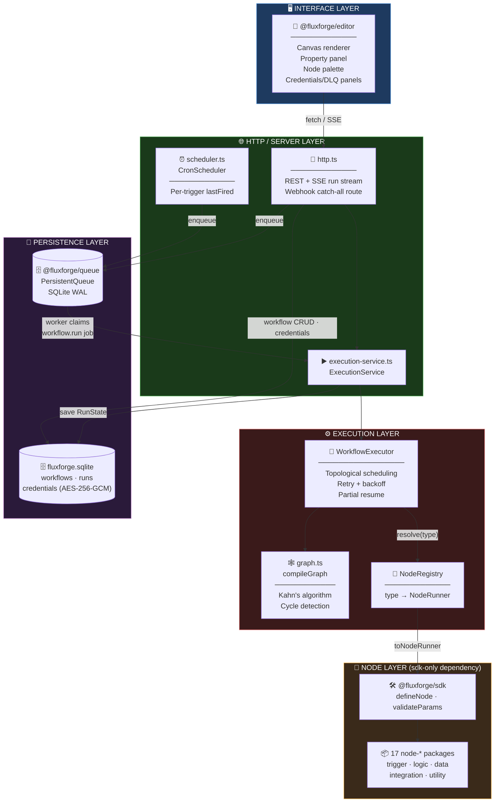
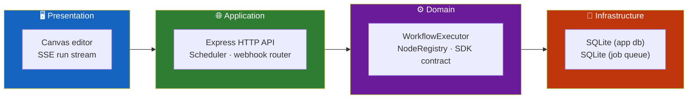
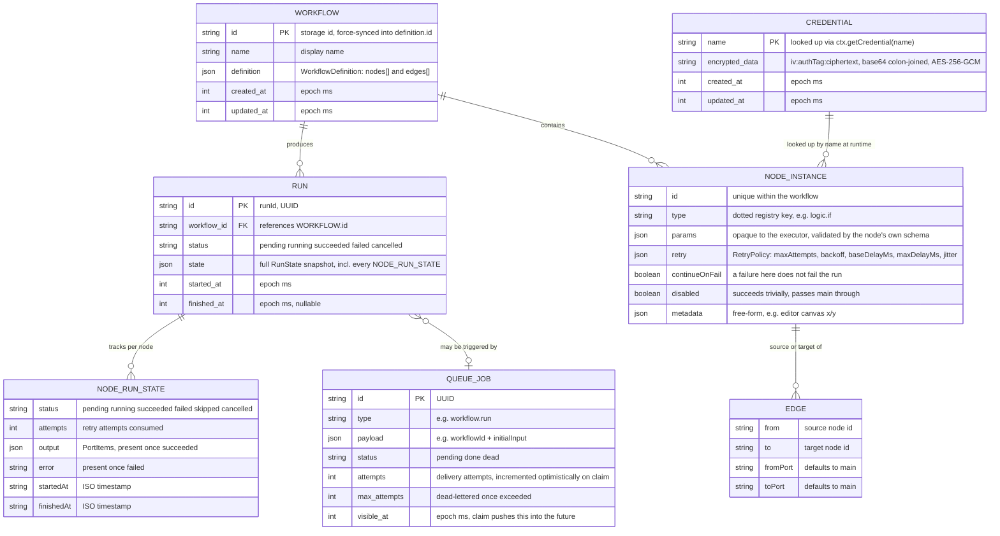
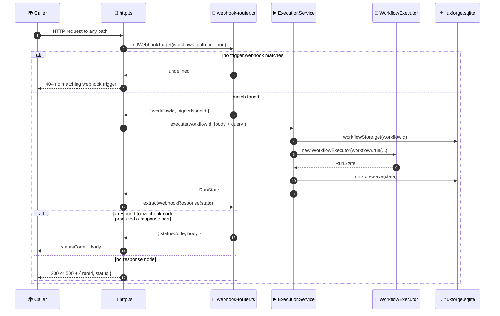
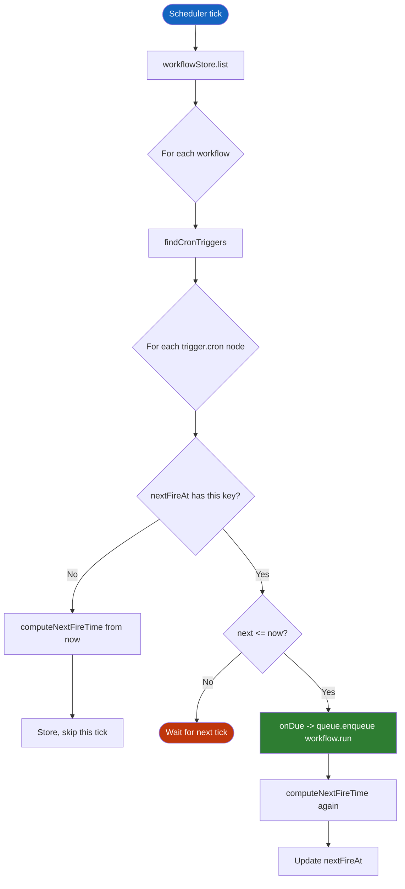
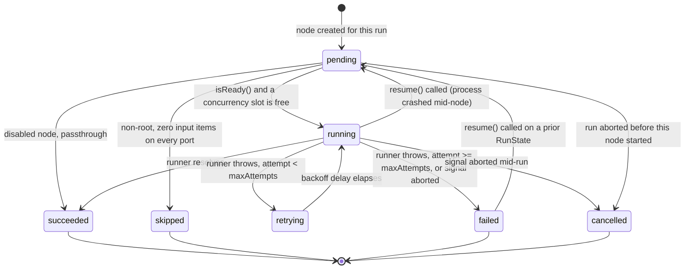
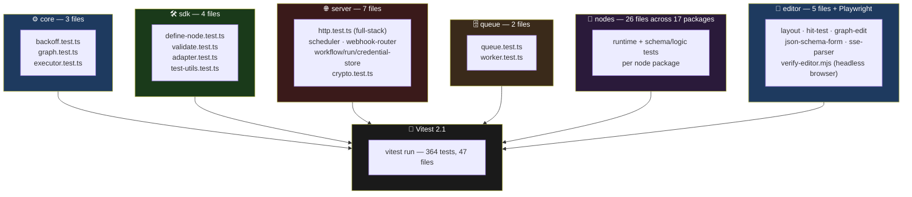

<div align="center">

**🌐 Choose Language / Selecione o Idioma / Elija el Idioma**

[](README.md)&nbsp;&nbsp;&nbsp;[](README_PT.md)&nbsp;&nbsp;&nbsp;[](README_ES.md)

</div>

---

<div align="center">

```
███████╗██╗     ██╗   ██╗██╗  ██╗███████╗ ██████╗ ██████╗  ██████╗ ███████╗
██╔════╝██║     ██║   ██║╚██╗██╔╝██╔════╝██╔═══██╗██╔══██╗██╔════╝ ██╔════╝
█████╗  ██║     ██║   ██║ ╚███╔╝ █████╗  ██║   ██║██████╔╝██║  ███╗█████╗
██╔══╝  ██║     ██║   ██║ ██╔██╗ ██╔══╝  ██║   ██║██╔══██╗██║   ██║██╔══╝
██║     ███████╗╚██████╔╝██╔╝ ██╗██║     ╚██████╔╝██║  ██║╚██████╔╝███████╗
╚═╝     ╚══════╝ ╚═════╝ ╚═╝  ╚═╝╚═╝      ╚═════╝ ╚═╝  ╚═╝ ╚═════╝ ╚══════╝
        A workflow automation engine, written from scratch in TypeScript
```

---

[](https://www.typescriptlang.org/)
[](https://nodejs.org/)
[](https://vitest.dev/)
[](https://www.sqlite.org/)
[](https://expressjs.com/)
[](https://vitejs.dev/)
[](https://zod.dev/)
[](LICENSE)

<br/>

> **An open-source workflow automation engine, written from scratch in real TypeScript.**
> A DAG executor with retry/backoff and crash-safe partial re-execution, a persistent SQLite job queue, a pluggable node SDK, and a canvas editor built with no diagramming library.

<br/>


</div>

---

## 📑 Table of Contents

<details>
<summary>▶️ <strong>Click to expand / collapse this section</strong></summary>

<table>
<tr>
<td valign="top" width="50%">

**🏗️ System**
- [Overview](#-overview)
- [System Architecture](#-system-architecture)
- [Technology Stack](#-technology-stack)
- [Design Patterns](#-design-patterns-applied)
- [Project Structure](#-project-structure)

**📦 Modules**
- [Core — DAG Executor](#-fluxforgecore--dag-executor)
- [SDK — Node Authoring](#-fluxforgesdk--node-authoring)
- [Registry](#-fluxforgeregistry)
- [Queue — Persistent Jobs](#-fluxforgequeue--persistent-job-queue)
- [Server](#-fluxforgeserver)
- [Editor](#-fluxforgeeditor)
- [Node Library (17 packages)](#-node-library-17-packages)

</td>
<td valign="top" width="50%">

**💼 Business**
- [Business Rules](#-business-rules)
- [Functional Requirements](#-functional-requirements)
- [Non-Functional Requirements](#-non-functional-requirements)

**📐 Design**
- [Data Model](#-data-model)
- [System Flows](#-system-flows)

**🔐 Security & Ops**
- [Security](#-security)
- [Installation & Execution](#-installation--execution)
- [Automated Tests](#-automated-tests)
- [Metrics & Monitoring](#-metrics--monitoring)
- [Known Limitations](#-known-limitations)

</td>
</tr>
</table>

---

</details>

## 🌟 Overview

<details>
<summary>▶️ <strong>Click to expand / collapse this section</strong></summary>

**FluxForge** is an open-source workflow automation engine written from scratch in TypeScript. n8n and Zapier are the reference points for what it does, not dependencies: nothing here is built on top of either. It gives you a directed-acyclic-graph executor with retry and exponential backoff, crash-safe partial re-execution, a persistent SQLite-backed job queue, a pluggable node system with a genuine third-party SDK, and a canvas-based visual editor built without a diagramming library.

The repository is an npm workspaces monorepo of 23 packages: `@fluxforge/core` (the executor), `@fluxforge/queue` (the job queue), `@fluxforge/sdk` (the node-authoring contract), `@fluxforge/registry` (node lookup), `@fluxforge/server` (the HTTP API, scheduler and webhook router), `@fluxforge/editor` (the browser UI), and 17 `@fluxforge/node-*` packages that ship trigger, logic, data, integration and utility nodes. Every package that isn't the editor or the server depends on nothing beyond `@fluxforge/core`, `@fluxforge/sdk`, and `zod`, which keeps a third-party node author's install footprint to a single dependency.

A workflow is a strict DAG: nodes and edges, no cycles. A "loop" is a node's own internal behavior, never a graph shape, because a cyclic graph has no well-defined topological order for retry and partial-resume logic to reason about. That single decision (documented as [ADR-0002](docs/adr/0002-dag-not-cyclic-graph.md) in the source) shapes almost everything else in this README: the executor's scheduling algorithm, the branch-skip rule, and the resume semantics.

### 🎯 System Objectives

| Objective | Description |
|-----------|-------------|
| ⚙️ **Deterministic DAG execution** | Topologically order and run a workflow's nodes with configurable concurrency, retrying failed nodes with backoff |
| 💾 **Crash-safe partial resume** | Persist a `RunState` after every node so a crashed or cancelled run can continue from where it stopped, never re-running succeeded work |
| 🔌 **Third-party node authoring** | Expose `defineNode()` as the entire contract a new integration package needs, with zod-validated params |
| 📥 **Persistent, crash-recoverable queueing** | Run workflows asynchronously via a SQLite job queue using a visibility-timeout claim model, no separate crash-sweep process |
| 🌐 **HTTP-triggered automation** | Receive webhooks and fire cron schedules against stored workflow definitions, with a REST API for everything else |
| 🔐 **Encrypted credential storage** | Store third-party API tokens and secrets encrypted at rest with AES-256-GCM |
| 🎨 **Visual authoring** | Let a person build, wire, run, and inspect a workflow on a pan/zoom canvas, with no external diagramming library |
| 🧪 **Verified correctness** | Back every package with real unit tests plus one full-stack HTTP integration test and a live browser end-to-end pass |

---

</details>

## 🏗️ System Architecture

<details>
<summary>▶️ <strong>Click to expand / collapse this section</strong></summary>

### Module Diagram



### Architecture Layers



---

</details>

## 🛠️ Technology Stack

<details>
<summary>▶️ <strong>Click to expand / collapse this section</strong></summary>

<table>
<thead>
<tr>
<th>Layer</th>
<th>Technology</th>
<th>Version</th>
<th>Purpose</th>
</tr>
</thead>
<tbody>
<tr>
<td rowspan="3"><strong>🧠 Language</strong></td>
<td>TypeScript</td>
<td>^5.7.2</td>
<td>Strict mode, project references (<code>tsc -b</code>), <code>verbatimModuleSyntax</code></td>
</tr>
<tr>
<td>Node.js</td>
<td>&gt;=20 (engines)</td>
<td>Runtime for the server, queue worker and scheduler</td>
</tr>
<tr>
<td>ESM (<code>"type": "module"</code>)</td>
<td>—</td>
<td>Every workspace package, uniformly</td>
</tr>
<tr>
<td rowspan="2"><strong>✅ Validation</strong></td>
<td>Zod</td>
<td>^4.4.3</td>
<td>Node <code>paramsSchema</code> definitions, runtime-validated per execution</td>
</tr>
<tr>
<td>JSON Schema (2020-12)</td>
<td>via <code>z.toJSONSchema</code></td>
<td>Serialized to the editor over <code>GET /api/nodes</code> for schema-driven forms</td>
</tr>
<tr>
<td rowspan="2"><strong>💾 Persistence</strong></td>
<td>better-sqlite3</td>
<td>^13.0.3</td>
<td>Synchronous SQLite driver, WAL journal mode, used by both the app db and the queue db</td>
</tr>
<tr>
<td>node:crypto</td>
<td>built-in</td>
<td>AES-256-GCM credential encryption, UUID generation</td>
</tr>
<tr>
<td rowspan="2"><strong>🌐 Server</strong></td>
<td>Express</td>
<td>^4.21.2</td>
<td>REST API, SSE run streaming, webhook catch-all route</td>
</tr>
<tr>
<td>tsx</td>
<td>^4.23.9</td>
<td>Zero-build watch mode for <code>npm run dev:server</code></td>
</tr>
<tr>
<td rowspan="2"><strong>🎨 Editor</strong></td>
<td>Vite</td>
<td>^6.0.7</td>
<td>Dev server (port 5180, proxies <code>/api</code>) and production build</td>
</tr>
<tr>
<td>Canvas 2D API</td>
<td>browser built-in</td>
<td>Node graph rendering — no diagramming library dependency</td>
</tr>
<tr>
<td rowspan="2"><strong>🔧 Build & Quality</strong></td>
<td>TypeScript project references</td>
<td><code>tsc -b tsconfig.json</code></td>
<td>Incremental composite builds across all 23 workspaces</td>
</tr>
<tr>
<td>ESLint + typescript-eslint</td>
<td>^9.17 / ^8.19</td>
<td><code>eqeqeq</code>, no <code>var</code>, consistent type imports, no unused vars</td>
</tr>
<tr>
<td rowspan="2"><strong>🧪 Testing</strong></td>
<td>Vitest</td>
<td>^2.1.8</td>
<td>364 tests across 47 files, path-aliased per workspace package</td>
</tr>
<tr>
<td>Playwright</td>
<td>^1.62.1</td>
<td>Headless-browser end-to-end pass driving the real editor UI</td>
</tr>
</tbody>
</table>

---

</details>

## 🎨 Design Patterns Applied

<details>
<summary>▶️ <strong>Click to expand / collapse this section</strong></summary>

| Pattern | Where | Rationale |
|---------|-------|-----------|
| 🏭 **Factory function** | `defineNode()` in `packages/sdk/src/define-node.ts` | Validates and freezes a `NodeDefinition` at authoring time so a malformed node fails in the author's own test suite, not mid-run |
| 🔌 **Adapter** | `toNodeRunner()` in `packages/sdk/src/adapter.ts` | Bridges the SDK's typed `NodeDefinition` into core's untyped `NodeRunner` function — the only place the two shapes meet |
| 📇 **Registry** | `NodeRegistry` in `packages/registry/src/registry.ts` | Collects built-in and third-party node definitions and exposes them as a `NodeRunnerResolver`, with zero opinion on which nodes exist |
| 🔁 **Strategy** | `NodeRunnerResolver.resolve(type)` in `packages/core/src/types.ts` | The executor is handed a resolver interface; it never knows whether a type maps to a built-in or third-party runner |
| 📡 **Observer / pub-sub** | `RunEventBus` in `packages/core/src/events.ts` | A minimal typed listener set per run, bridged 1:1 to Server-Sent Events by `http.ts` |
| ⏳ **Visibility-timeout claim** | `PersistentQueue.claim()` in `packages/queue/src/queue.ts` | Crash recovery falls out of the claim model itself (expired `visible_at`), no separate heartbeat sweep process needed |
| 🧱 **Immutable command objects** | `graph-edit.ts` in `packages/editor/src/graph-edit.ts` | Every edit returns a new `WorkflowDefinition` rather than mutating one, keeping undo/redo trivial |
| 🚦 **Guard clause / fail-fast** | `compileGraph()` in `packages/core/src/graph.ts`, `getEncryptionKey()` in `packages/server/src/crypto.ts` | Duplicate node ids, dangling edges, cycles, and a missing encryption key all throw immediately rather than degrading silently |
| 🧩 **Dependency injection** | `ExecutorOptions` (`now`, `random`, `sleep`) in `packages/core/src/executor.ts` | Clock, RNG and sleep are injectable, which is what makes retry-timing tests exact instead of "eventually, probably" |

---

</details>

## 📁 Project Structure

<details>
<summary>▶️ <strong>Click to expand / collapse this section</strong></summary>

```
fluxforge/
│
├── 📄 package.json                    # Root workspaces manifest, npm scripts (build/test/lint/check)
├── 📄 tsconfig.json                   # Project-references root — one entry per workspace package
├── 📄 tsconfig.base.json              # Shared strict compiler options (ES2022, verbatimModuleSyntax)
├── 📄 vitest.config.ts                # Path aliases per workspace + auto-discovered node-* aliases
├── 📄 eslint.config.js                # typescript-eslint flat config (eqeqeq, no-var, ...)
│
├── 📂 docs/
│   └── 📂 adr/                        # Architecture Decision Records (ADR-0002..0005 referenced below)
│
├── 📂 examples/
│   ├── 📄 README.md                   # How to load the two example workflows
│   ├── 📄 webhook-echo.json           # trigger.webhook -> respond-to-webhook round trip
│   └── 📄 scheduled-slack-digest.json # trigger.cron -> rss-read -> slack-webhook chain
│
├── 📂 scripts/
│   ├── 📄 scaffold-node.mjs           # `npm run scaffold:node` — generates a new node package
│   └── 📄 verify-editor.mjs           # Playwright end-to-end driver for the editor
│
├── 📂 packages/
│   ├── 📂 core/                       # @fluxforge/core — DAG types, graph compiler, executor, backoff
│   │   └── 📂 src/
│   │       ├── 📄 types.ts            # WorkflowDefinition, NodeInstance, RunState, RunEvent, ...
│   │       ├── 📄 graph.ts            # compileGraph — Kahn's algorithm + cycle detection
│   │       ├── 📄 executor.ts         # WorkflowExecutor — run() / resume()
│   │       ├── 📄 backoff.ts          # calculateBackoffDelay — fixed/exponential + jitter
│   │       └── 📄 events.ts           # RunEventBus — typed pub/sub per run
│   │
│   ├── 📂 sdk/                        # @fluxforge/sdk — defineNode() and the whole authoring contract
│   ├── 📂 registry/                   # @fluxforge/registry — NodeRegistry, NodeRunnerResolver factory
│   ├── 📂 queue/                      # @fluxforge/queue — PersistentQueue (SQLite), QueueWorker
│   ├── 📂 server/                     # @fluxforge/server — HTTP API, scheduler, credentials, webhooks
│   │   └── 📂 src/
│   │       ├── 📄 http.ts             # Express app: REST + SSE + webhook catch-all
│   │       ├── 📄 main.ts             # Real bootstrap — wires db, queue, scheduler, registry, http
│   │       ├── 📄 scheduler.ts        # CronScheduler — per-trigger lastFired polling
│   │       ├── 📄 crypto.ts           # AES-256-GCM encrypt/decrypt
│   │       ├── 📄 credential-store.ts # Encrypted-at-rest credential CRUD
│   │       ├── 📄 webhook-router.ts   # findWebhookTarget / extractWebhookResponse
│   │       ├── 📄 workflow-store.ts   # Workflow CRUD over SQLite
│   │       ├── 📄 run-store.ts        # RunState persistence
│   │       ├── 📄 execution-service.ts# Ties registry + stores into execute()/resume()
│   │       ├── 📄 builtins.ts         # The only file that imports every node-* package
│   │       └── 📄 db.ts               # openDb — workflows/runs/credentials schema
│   │
│   ├── 📂 editor/                     # @fluxforge/editor — the canvas-based visual editor
│   │   └── 📂 src/
│   │       ├── 📄 app.ts              # EditorApp — controller wiring DOM/canvas to graph-edit
│   │       ├── 📄 canvas.ts           # Pixel-pushing render() — reads layout.ts's pure geometry
│   │       ├── 📄 layout.ts           # Pure node/port/edge geometry, unit-testable
│   │       ├── 📄 hit-test.ts         # Pure hit-testing for ports/edges/node bodies
│   │       ├── 📄 graph-edit.ts       # Pure, immutable WorkflowDefinition edits
│   │       ├── 📄 api-client.ts       # Typed fetch wrapper over the server's REST + SSE surface
│   │       ├── 📄 json-schema-form.ts # JSON Schema -> form-field descriptors
│   │       ├── 📄 property-panel.ts   # Schema-driven node property form
│   │       ├── 📄 node-palette.ts     # Sidebar list of registered node types by category
│   │       ├── 📄 credentials-panel.ts# Modal over /api/credentials
│   │       ├── 📄 dead-letter-panel.ts# Modal over /api/dead-letter + requeue
│   │       └── 📄 sse-parser.ts       # Pure SSE-chunk parser (fetch body, not EventSource)
│   │
│   └── 📂 nodes/                      # 17 @fluxforge/node-* packages, each: package.json, src/schema.ts, src/runtime.ts
│       ├── 📂 manual/  📂 cron/  📂 webhook/            # trigger category
│       ├── 📂 if/  📂 switch/  📂 filter/               # logic category
│       ├── 📂 set/  📂 aggregate/  📂 code/             # data category
│       ├── 📂 http-request/                             # action category
│       ├── 📂 slack-webhook/  📂 discord-webhook/
│       │   📂 github-issue/  📂 rss-read/
│       │   📂 google-sheets-append/                     # integration category
│       └── 📂 no-op/  📂 respond-to-webhook/             # utility category
│
├── 📄 README.md                       # 🇺🇸 English (primary)
├── 📄 README_PT.md                    # 🇧🇷 Português
└── 📄 README_ES.md                    # 🇪🇸 Español
```

---

</details>

## 📦 System Modules

<details>
<summary>▶️ <strong>Click to expand / collapse this section</strong></summary>

### ⚙️ `@fluxforge/core` — DAG Executor

The DAG types, graph compilation, the executor, retry/backoff, and partial-execution resume. Depends on nothing else in the monorepo.

| Responsibility | Implementation |
|-----------------|-----------------|
| Graph validation & indexing | `compileGraph()` — duplicate node ids, dangling edges and cycles all throw `GraphValidationError` |
| Topological ordering | `topologicalSort()` — Kahn's algorithm; a non-empty leftover queue is a direct cycle certificate |
| Scheduling | `WorkflowExecutor.execute()` — runs ready nodes up to `concurrency` (default 4) concurrently via `Promise.race` |
| Branch skip cascade | A non-root node with zero gathered input items on every port is marked `skipped`, not run — no special-cased branch-node logic anywhere |
| Retry with backoff | `calculateBackoffDelay(attempt, policy, random)` — fixed or exponential, capped by `maxDelayMs` before jitter is applied |
| Partial resume | `WorkflowExecutor.resume(previous)` — `succeeded`/`skipped` nodes are reused as-is; `running`/`failed` nodes reset to `pending`, attempt 1 |
| Event emission | `RunEventBus` — `run.started/succeeded/failed/cancelled`, `node.started/succeeded/retrying/failed/skipped` |

---

### 🛠️ `@fluxforge/sdk` — Node Authoring

The entire third-party node authoring contract: `defineNode()`, zod-validated params, a `NodeDefinition`-to-`NodeRunner` adapter, and test utilities. Depends only on `@fluxforge/core` and `zod`.

| Responsibility | Implementation |
|-----------------|-----------------|
| Definition validation | `defineNode()` — enforces a dot-separated lowercase `type` (`TYPE_PATTERN`), non-empty `displayName`/`description`, unique port ids |
| Params validation | `validateParams()` — parses raw params against `paramsSchema` per execution (not per save), since a param can be resolved differently between runs |
| Core bridge | `toNodeRunner(def, credentials)` — the only place a `NodeDefinition` becomes a plain `NodeRunner` core can call |
| Credential lookup | `CredentialResolver.getCredential(name)` — injected per resolver; defaults to a no-op resolver when omitted |
| Test utilities | `createTestContext()`, `runNode()` — build a `NodeContext` and run a node exactly the way the real executor does, without importing the executor |

---

### 📇 `@fluxforge/registry`

Collects `NodeDefinition`s (built-in or third-party) and exposes them as a `NodeRunnerResolver` for the executor and a listing for the editor's palette. Depends on core and sdk.

| Method | Behavior |
|--------|----------|
| `register(def)` | Throws `DuplicateNodeTypeError` if `def.type` is already registered |
| `registerAll(defs)` | Convenience used by `builtins.ts` to register all 17 built-in nodes at once |
| `list()` | Every registered definition — what backs `GET /api/nodes` and the editor's palette |
| `createResolver(credentials?)` | Returns a `NodeRunnerResolver` bound to one credential resolver, caching `toNodeRunner` results per type |

---

### 🗄️ `@fluxforge/queue` — Persistent Job Queue

A persistent job queue on SQLite (`better-sqlite3`): visibility-timeout claims, backoff-scheduled retries, dead-lettering, and a small poll-loop worker.

| Method | Behavior |
|--------|----------|
| `enqueue(type, payload, options)` | Inserts a `pending` job; `visible_at` defaults to now plus `delayMs` |
| `claim(visibilityTimeoutMs, type?)` | Runs inside `BEGIN IMMEDIATE` (not deferred) so two processes sharing one file never double-claim; auto dead-letters a job whose next attempt would exceed `maxAttempts` |
| `complete(jobId)` | Marks a claimed job `done` |
| `fail(jobId, error, policy?)` | Reschedules with `calculateBackoffDelay` if attempts remain, else marks `dead` |
| `release(jobId)` | Un-does the optimistic attempt increment for a graceful shutdown, distinct from a real failure |
| `deadLetter()` / `requeue(jobId)` | List and reset dead-lettered jobs back to a fresh `pending` attempt cycle |
| `QueueWorker` | A `claim → handler → complete/fail` poll loop; `stop()` lets the in-flight job finish rather than aborting it |

---

### 🌐 `@fluxforge/server`

The HTTP server tying everything together: workflow CRUD, direct and queued run execution, webhook receiving, cron scheduling, and encrypted-at-rest credential storage.

| Component | File | Responsibility |
|-----------|------|-----------------|
| Database | `db.ts` | One SQLite file (`workflows`, `runs`, `credentials` tables), separate from the queue's own db file |
| Workflow store | `workflow-store.ts` | `save()` force-sets `definition.id` to the storage id so `RunState.workflowId` can never disagree with the lookup key |
| Run store | `run-store.ts` | Persists every `RunState`, what makes run history survive a restart and `resume()` findable |
| Credential store | `credential-store.ts` + `crypto.ts` | AES-256-GCM (`node:crypto`), key from `FLUXFORGE_CREDENTIALS_KEY` (32 bytes, base64) |
| Execution service | `execution-service.ts` | Builds a `WorkflowExecutor` per call, awaits the run, persists the result |
| Webhook router | `webhook-router.ts` | `findWebhookTarget()` linear-scans stored workflows for a matching `trigger.webhook` node; `extractWebhookResponse()` reads the first `response` port in a finished run |
| Scheduler | `scheduler.ts` | `CronScheduler` polls every `trigger.cron` node, tracking a per-trigger `lastFired` so a newly added workflow doesn't fire for time it "missed" |
| HTTP app | `http.ts` | Express app: `/api/nodes`, `/api/workflows*`, `/api/runs/:id`, `/api/credentials*`, `/api/dead-letter*`, plus a catch-all webhook route |
| Bootstrap | `main.ts` | The one file that wires db, stores, registry, queue worker, scheduler, and HTTP app together |

---

### 🎨 `@fluxforge/editor`

The browser-based visual workflow editor: a canvas node graph, a schema-driven property panel, and live run status. Depends only on core and sdk (for types).

| Component | File | Responsibility |
|-----------|------|-----------------|
| Controller | `app.ts` | `EditorApp` — owns mutable editor state, wires DOM/canvas events to pure `graph-edit.ts` functions |
| Renderer | `canvas.ts` | Deliberately untested pixel-pushing; everything it draws (positions, hits) is decided elsewhere |
| Geometry | `layout.ts` | Pure node/port/edge geometry: `computeNodeLayout`, `bezierControlOffset`, `resolveEdgeEndpoints` |
| Hit testing | `hit-test.ts` | Pure port/edge/node-body hit tests, tolerance divided by current zoom |
| Graph edits | `graph-edit.ts` | Pure, immutable `WorkflowDefinition` transforms — `addNode`, `removeEdge`, `updateNodeParams`, ... |
| API client | `api-client.ts` | Typed `fetch` wrapper for the REST surface plus SSE run streaming |
| Schema forms | `json-schema-form.ts` | Reads a node's JSON Schema (draft 2020-12, as emitted by `z.toJSONSchema`) into form-field descriptors |
| Property panel | `property-panel.ts` | Rebuilds a form from scratch per `show()` from the selected node's schema |
| Node palette | `node-palette.ts` | Sidebar list of registered node types, grouped by category |
| Credentials panel | `credentials-panel.ts` | Modal over `/api/credentials`; shows names only, values never leave the server |
| Dead-letter panel | `dead-letter-panel.ts` | Modal listing `PersistentQueue.deadLetter()` with a requeue action |
| SSE parser | `sse-parser.ts` | Pure `parseSseChunk()` for `fetch()`-body SSE, since `EventSource` can't issue the `POST` a run start needs |

---

### 🧩 Node Library (17 packages)

Every node package depends on nothing but `@fluxforge/sdk` (and `zod`, transitively). Each exports one `defineNode()` result from `src/runtime.ts`, validated by `src/schema.ts`.

| Type | Category | Package | Behavior |
|------|----------|---------|----------|
| `trigger.manual` | trigger | `node-manual` | Passes the run's seeded `initialInput` straight through — the default trigger every new workflow starts with |
| `trigger.cron` | trigger | `node-cron` | Emits `{ firedAt }` when invoked; `CronScheduler` decides *when* via `nextFireTime(expression, after)` (UTC-only 5-field cron) |
| `trigger.webhook` | trigger | `node-webhook` | Declarative only — `path`/`method` params `findWebhookTarget` matches against incoming requests; passthrough `run()` |
| `logic.if` | logic | `node-if` | Splits items individually into `true`/`false` ports by one field/operator/value condition |
| `logic.switch` | logic | `node-switch` | Routes each item to one of five fixed `case-0`..`case-4` ports (strict-equality) or `default` |
| `logic.filter` | logic | `node-filter` | Keeps only matching items on a single `main` port, dropping the rest |
| `data.set` | data | `node-set` | Removes fields, then applies `set` overrides — `remove` before `set` so a re-assigned field is never re-deleted |
| `data.aggregate` | data | `node-aggregate` | Reduces items to one summary item (or one per `groupBy` value): sum/count/avg/min/max over a numeric field |
| `data.code` | data | `node-code` | Evaluates a JS expression per item via `new Function` — unsandboxed, full process privileges, self-authored workflows only |
| `action.http-request` | action | `node-http-request` | Fetches per item (or once) with timeout (`AbortController`, default 10s), optional bearer credential, `ignoreHttpErrors` toggle |
| `integration.slack-webhook` | integration | `node-slack-webhook` | Posts `text`/`channel`/`username` to a Slack Incoming Webhook URL |
| `integration.discord-webhook` | integration | `node-discord-webhook` | Posts `content`/`username` to a Discord webhook URL |
| `integration.github-issue` | integration | `node-github-issue` | Creates a GitHub issue via the REST API; requires a `github` credential with a `token` field |
| `integration.rss-read` | integration | `node-rss-read` | Fetches and parses an RSS/Atom feed into `title`/`link`/`publishedAt` items (root node, no inputs) |
| `integration.google-sheets-append` | integration | `node-google-sheets-append` | Appends a row via Sheets API v4 `values.append`; requires a `google` credential with an OAuth2 `token` |
| `utility.no-op` | utility | `node-no-op` | Passes `main` through unchanged — a placeholder for a workflow still being built |
| `utility.respond-to-webhook` | utility | `node-respond-to-webhook` | Declares the HTTP status/body a webhook-triggered run should answer with; read by `webhook-router.ts`, never wired downstream |

---

</details>

## 💼 Business Rules

<details>
<summary>▶️ <strong>Click to expand / collapse this section</strong></summary>

### 🕸️ Graph Shape Rules

| # | Rule | Enforcement |
|---|------|-------------|
| BR-01 | A workflow's node ids must be unique | `compileGraph()` throws `GraphValidationError` on a duplicate |
| BR-02 | Every edge must reference existing node ids on both ends | `compileGraph()` throws on a dangling `from`/`to` |
| BR-03 | A workflow graph must contain no cycles | `topologicalSort()`'s leftover queue check throws, naming the stuck nodes |
| BR-04 | A "loop" is a node's own runtime behavior, never a graph shape | No cyclic-graph construct exists anywhere in `@fluxforge/core` (ADR-0002) |

### ▶️ Execution Rules

| # | Rule | Enforcement |
|---|------|-------------|
| BR-05 | A node only becomes eligible once every predecessor reaches a terminal status | `isReady()` in `executor.ts` |
| BR-06 | A non-root node with zero gathered input items on every port is skipped, not run | The generic empty-input skip rule, no branch-node special case |
| BR-07 | A `failed` or `skipped` predecessor contributes zero items downstream | `gatherInput()` only reads from `succeeded` sources |
| BR-08 | A node whose type has no registered runner fails the run (unless `continueOnFail`) | `runOneNode()`'s resolver-miss branch |
| BR-09 | A disabled node succeeds trivially, passing its `main` input through | `if (node.disabled)` branch in `runOneNode()` |
| BR-10 | Retries consume the node's own `maxAttempts` budget; a process crash mid-node does not | `resume()` resets `running` nodes to `pending`, attempt 1 |

### 🗄️ Queue Rules

| # | Rule | Enforcement |
|---|------|-------------|
| BR-11 | A job's `attempts` counts delivery attempts, not completed executions | Incremented optimistically inside `claim()`, before the handler runs |
| BR-12 | A job whose next delivery would exceed `maxAttempts` is dead-lettered by the claim path itself | `claim()`'s `nextAttempts > row.max_attempts` branch, no separate sweep |
| BR-13 | Two processes sharing one SQLite file must never double-claim the same job | `claim()` runs inside `BEGIN IMMEDIATE`, not a deferred transaction |
| BR-14 | A graceful worker shutdown must not count as a delivery failure | `release()` decrements the optimistic `attempts` increment |

### 🔐 Credential & Server Rules

| # | Rule | Enforcement |
|---|------|-------------|
| BR-15 | A stored workflow's `definition.id` must always equal its storage id | `WorkflowStore.save()` force-overwrites `definition.id` |
| BR-16 | Credential values are never returned by the list endpoint | `GET /api/credentials` returns `credentialStore.list()` (names only) |
| BR-17 | The server must refuse to start without a valid 32-byte encryption key | `getEncryptionKey()` throws `MissingEncryptionKeyError` |

---

</details>

## ✅ Functional Requirements

<details>
<summary>▶️ <strong>Click to expand / collapse this section</strong></summary>

| ID | Requirement | Priority | Status |
|----|-------------|----------|--------|
| **RF-01** | The system shall compile a workflow definition into an indexed, validated graph | 🔴 High | ✅ Implemented |
| **RF-02** | The system shall detect and reject cyclic workflow graphs | 🔴 High | ✅ Implemented |
| **RF-03** | The system shall execute ready nodes concurrently up to a configurable limit | 🔴 High | ✅ Implemented |
| **RF-04** | The system shall retry a failed node with fixed or exponential backoff and jitter | 🔴 High | ✅ Implemented |
| **RF-05** | The system shall skip a non-root node that receives zero input items | 🔴 High | ✅ Implemented |
| **RF-06** | The system shall persist a `RunState` after execution completes | 🔴 High | ✅ Implemented |
| **RF-07** | The system shall resume a prior run without re-running succeeded nodes | 🔴 High | ✅ Implemented |
| **RF-08** | The system shall let a third-party package define a node via `defineNode()` | 🔴 High | ✅ Implemented |
| **RF-09** | The system shall validate a node's params against its own zod schema per execution | 🔴 High | ✅ Implemented |
| **RF-10** | The system shall expose every registered node type over `GET /api/nodes` with a JSON Schema | 🟡 Medium | ✅ Implemented |
| **RF-11** | The system shall persist jobs to a durable SQLite-backed queue | 🔴 High | ✅ Implemented |
| **RF-12** | The system shall reclaim a crashed worker's job once its visibility timeout expires | 🔴 High | ✅ Implemented |
| **RF-13** | The system shall dead-letter a job that exhausts its retry budget and allow requeueing it | 🟡 Medium | ✅ Implemented |
| **RF-14** | The system shall accept workflow CRUD over a REST API | 🔴 High | ✅ Implemented |
| **RF-15** | The system shall stream live run events over Server-Sent Events | 🟡 Medium | ✅ Implemented |
| **RF-16** | The system shall route an incoming HTTP request to a matching `trigger.webhook` node | 🔴 High | ✅ Implemented |
| **RF-17** | The system shall respond to a webhook-triggered run using a `respond-to-webhook` node's output | 🟡 Medium | ✅ Implemented |
| **RF-18** | The system shall fire `trigger.cron` nodes according to a 5-field cron expression | 🔴 High | ✅ Implemented |
| **RF-19** | The system shall store credentials encrypted at rest with AES-256-GCM | 🔴 High | ✅ Implemented |
| **RF-20** | The system shall never return a credential's value from the listing endpoint | 🔴 High | ✅ Implemented |
| **RF-21** | The system shall let a user visually build and edit a workflow on a pan/zoom canvas | 🔴 High | ✅ Implemented |
| **RF-22** | The system shall render a schema-driven property form for the selected node | 🟡 Medium | ✅ Implemented |
| **RF-23** | The system shall let a user run a workflow from the editor and see live node status | 🟡 Medium | ✅ Implemented |
| **RF-24** | The system shall let a user manage credentials and dead-lettered jobs from the editor UI | 🟢 Low | ✅ Implemented |
| **RF-25** | The system shall generate a new node package's scaffold via a CLI command | 🟢 Low | ✅ Implemented |

---

</details>

## ⚡ Non-Functional Requirements

<details>
<summary>▶️ <strong>Click to expand / collapse this section</strong></summary>

| ID | Category | Requirement | Target |
|----|----------|-------------|--------|
| **RNF-01** | ⚡ Performance | Executor node-lookup hot path | O(1) `Map` lookups, indexed once per run by `compileGraph()` |
| **RNF-02** | ⚡ Performance | Default execution concurrency | 4 concurrent nodes (`ExecutorOptions.concurrency`) |
| **RNF-03** | 🔐 Security | Credential encryption | AES-256-GCM, 32-byte key from `FLUXFORGE_CREDENTIALS_KEY` |
| **RNF-04** | 🔐 Security | Server startup without an encryption key | Must fail fast (`MissingEncryptionKeyError`), never start unencrypted |
| **RNF-05** | 🧱 Reliability | Cross-process queue claim safety | `BEGIN IMMEDIATE` transaction, never a deferred one |
| **RNF-06** | 🧱 Reliability | Crash recovery | Falls out of the visibility-timeout model; no separate sweep process |
| **RNF-07** | 🧪 Testability | Executor timing determinism | `now`, `random`, `sleep` all injectable in `ExecutorOptions` |
| **RNF-08** | 🧪 Testability | Test suite size and pass rate | 364 tests, 47 files, 100% passing at time of writing |
| **RNF-09** | 🧩 Extensibility | Third-party node dependency footprint | `@fluxforge/sdk` + `zod` only, never core/queue/server/editor |
| **RNF-10** | 🧩 Extensibility | New node scaffold time | One CLI command (`npm run scaffold:node`) generates the full file layout |
| **RNF-11** | 🔧 Maintainability | Build system | `tsc -b` project references across 23 composite packages |
| **RNF-12** | 🔧 Maintainability | Lint discipline | `eqeqeq`, no `var`, no unused vars, consistent type-only imports enforced |
| **RNF-13** | 📦 Portability | Runtime dependency | Node.js >=20, no native build step beyond `better-sqlite3`'s prebuilt binary |
| **RNF-14** | 🌐 Compatibility | Editor browser requirement | Any browser with Canvas 2D and `fetch`; no bundler-specific runtime feature |
| **RNF-15** | 📈 Scalability (stated, honest) | Webhook route matching | Linear scan over stored workflows' nodes — explicitly acceptable at self-hosted scale, not indexed |
| **RNF-16** | ♿ Usability | Credential UI safety | Values never rendered or transmitted back to the browser after being set |

---

</details>

## 🗄️ Data Model

<details>
<summary>▶️ <strong>Click to expand / collapse this section</strong></summary>

FluxForge persists to two separate SQLite files (`db.ts` for the application, `queue.ts` for jobs), deliberately kept apart since the queue package has no idea what a "workflow" is.

### Entity-Relationship Diagram



### Application Database Schema (`fluxforge.sqlite`)

| Table | Key columns | Notes |
|-------|-------------|-------|
| `workflows` | `id` (PK), `name`, `definition` (JSON text), `created_at`, `updated_at` | `definition.id` is always force-synced to `id` on save |
| `runs` | `id` (PK), `workflow_id`, `status`, `state` (JSON text), `started_at`, `finished_at` | Indexed by `(workflow_id, started_at DESC)` for `listForWorkflow` |
| `credentials` | `name` (PK), `encrypted_data`, `created_at`, `updated_at` | `encrypted_data` is never decrypted outside `CredentialStore.getCredential` |

### Queue Database Schema (`fluxforge-queue.sqlite`)

| Column | Type | Notes |
|--------|------|-------|
| `id`, `type`, `payload` | TEXT | `payload` is JSON text |
| `status` | TEXT | `pending` \| `done` \| `dead` |
| `attempts`, `max_attempts` | INTEGER | A delivery counter, not a completed-execution counter |
| `backoff_kind`, `base_delay_ms`, `max_delay_ms` | TEXT / INTEGER | Feeds `calculateBackoffDelay` on `fail()` |
| `visible_at` | INTEGER | Indexed with `status` for the `claim()` query |

---

</details>

## 🔄 System Flows

<details>
<summary>▶️ <strong>Click to expand / collapse this section</strong></summary>

### Webhook-Triggered Execution Flow



### Cron Scheduling Flow



### Node Execution & Retry State Machine



---

</details>

## 🔐 Security

<details>
<summary>▶️ <strong>Click to expand / collapse this section</strong></summary>

### Implemented Controls

| Control | Implementation | Effect |
|---------|-----------------|--------|
| 🔐 **Credential encryption at rest** | AES-256-GCM via `node:crypto` in `crypto.ts`, key from `FLUXFORGE_CREDENTIALS_KEY` | A stolen SQLite file cannot be read without the 32-byte key |
| 🚫 **Fail-fast on missing key** | `getEncryptionKey()` throws `MissingEncryptionKeyError` if the env var is unset or malformed | The server never starts silently unencrypted |
| 🔏 **Authenticated encryption** | AES-GCM's `authTag` is verified on every `decrypt()` | Tampered ciphertext fails decryption rather than returning corrupted plaintext |
| 🙈 **Credential values never listed** | `GET /api/credentials` returns `credentialStore.list()` — names only | The editor's credentials panel cannot leak a value even if it tried |
| 🔀 **Random IV per encryption** | `randomBytes(12)` generated fresh in every `encrypt()` call | Two identical secrets never produce identical ciphertext |
| ✅ **Params validated per execution** | `validateParams()` runs `def.paramsSchema.safeParse` before every `run()` call | A malformed or tampered saved workflow cannot hand a node unexpected shapes |
| 🧾 **Workflow id integrity** | `WorkflowStore.save()` force-syncs `definition.id` to the storage id | A crafted body with a mismatched id can never desynchronize run lookups |
| ⏱️ **Bounded outbound requests** | `action.http-request`'s `withTimeout()` aborts via `AbortController` after `timeoutMs` (default 10s) | A hung upstream cannot block a node indefinitely |

### Known Security Limitations

> [!WARNING]
> The following are inherent to the current design and are stated plainly, not glossed over.

| Limitation | Risk | Mitigation path |
|------------|------|-----------------|
| 🖥️ **`data.code` runs unsandboxed** | Arbitrary JS via `new Function` has full process privileges (filesystem, network, env vars) | Explicitly scoped to self-authored workflows only; a real sandbox (`vm2`/`isolated-vm`) is required before running untrusted definitions |
| 🔓 **No authentication on the HTTP API** | Any caller reaching the server can read/write workflows, credentials, and trigger runs | Deploy behind a reverse proxy with auth, or add an auth middleware before exposing the port publicly |
| 🔑 **The running process holds the decryption key in memory** | A compromise of the server process itself can decrypt any credential on lookup | The same trust boundary every self-hosted secrets store has; not solvable without a separate secrets service |
| 🌐 **Webhook routes have no signature verification** | Anyone who knows a workflow's `path` can trigger it | Add a shared-secret header check inside the triggered workflow (e.g. a `logic.if` on a header value) |
| 🔍 **Webhook target matching is a linear scan** | Every request against the catch-all route scans every stored workflow's every node | Acceptable at self-hosted scale; would need an index at a much larger workflow count |
| 🧯 **No rate limiting anywhere in `http.ts`** | A workflow's webhook or the REST API can be hammered without backpressure | Add a rate-limiting middleware (e.g. `express-rate-limit`) in front of `createHttpApp` |
| 📝 **Node loggers passed to `run()` are no-ops by default** | Nothing prevents a node from logging a secret it received via `getCredential` | `makeLogger` is injectable in `ExecutorOptions`; a deployment should wire a redacting logger |

---

</details>

## 🚀 Installation & Execution

<details>
<summary>▶️ <strong>Click to expand / collapse this section</strong></summary>

### Prerequisites

```bash
# Node.js 20 or newer
node -v          # expect v20+

# npm workspaces support (bundled with modern npm)
npm -v
```

### Build

```bash
# Install every workspace's dependencies in one pass
npm install

# Type-check and build every package via tsc -b project references
npm run build

# Remove all build output and rebuild from scratch
npm run build:clean

# Type-check only, no emit-affecting build
npm run typecheck

# Lint the whole monorepo
npm run lint
npm run lint:fix

# Everything: lint, build, and test in one command
npm run check
```

### Execution

```bash
# Run the full test suite (364 tests, 47 files)
npm test
npm run test:watch     # watch mode

# Start the HTTP server (needs a 32-byte base64 encryption key)
FLUXFORGE_CREDENTIALS_KEY=$(node -e "console.log(require('crypto').randomBytes(32).toString('base64'))") \
  npm run dev:server
# -> FluxForge server listening on :3000

# Start the visual editor (proxies /api to the server)
npm run dev:editor
# -> editor at http://localhost:5180

# Scaffold a brand-new node package
npm run scaffold:node -- my-node action "My Node"
```

A minimal round trip without the editor:

```bash
curl -s -X POST http://localhost:3000/api/workflows \
  -H 'Content-Type: application/json' \
  -d @examples/webhook-echo.json

curl -s -X POST http://localhost:3000/hooks/echo -d '{}' -H 'Content-Type: application/json'
# -> {"ok":true}
```

### npm Scripts

| Script | Purpose |
|--------|---------|
| `npm run build` | `tsc -b tsconfig.json` — project-references build across all 23 packages |
| `npm run build:clean` | Same, with `--clean` first |
| `npm run typecheck` | Same as `build` (project references make them equivalent here) |
| `npm test` / `npm run test:watch` | Vitest — run once, or watch |
| `npm run lint` / `npm run lint:fix` | ESLint across `.` |
| `npm run check` | `lint && build && test`, the full local gate |
| `npm run scaffold:node -- <name> <category> "<Display Name>"` | Generates a new `packages/nodes/<name>` package |
| `npm run dev:server` | `tsx watch src/main.ts` inside `@fluxforge/server` |
| `npm run dev:editor` | `vite` dev server inside `@fluxforge/editor`, port 5180 |

### Build Configuration

| Setting | Value | Declared in |
|---------|-------|-------------|
| `target` / `module` | ES2022 / ESNext | `tsconfig.base.json` |
| `moduleResolution` | Bundler | `tsconfig.base.json` |
| `strict`, `noUncheckedIndexedAccess`, `exactOptionalPropertyTypes` | all `true` | `tsconfig.base.json` |
| `composite`, `declaration`, `declarationMap` | all `true` | `tsconfig.base.json` — required for project references |
| `verbatimModuleSyntax` | `true` | `tsconfig.base.json` — forces explicit `type` imports |
| Editor dev server port | `5180` | `packages/editor/vite.config.ts` |
| Server default port | `3000` (`process.env.PORT`) | `packages/server/src/main.ts` |
| App db path default | `./fluxforge.sqlite` (`FLUXFORGE_DB_PATH`) | `packages/server/src/main.ts` |
| Queue db path default | `./fluxforge-queue.sqlite` (`FLUXFORGE_QUEUE_DB_PATH`) | `packages/server/src/main.ts` |

---

</details>

## 🧪 Automated Tests

<details>
<summary>▶️ <strong>Click to expand / collapse this section</strong></summary>

### Test Architecture



| Package | Test files | What's covered |
|---------|------------|-----------------|
| `core` | `backoff.test.ts`, `graph.test.ts`, `executor.test.ts` | Backoff math, cycle detection, full run/resume/retry/skip semantics |
| `sdk` | `define-node.test.ts`, `validate.test.ts`, `adapter.test.ts`, `test-utils.test.ts` | Definition shape validation, params validation, the core bridge, test helpers |
| `registry` | `registry.test.ts` | Duplicate-type rejection, resolver caching |
| `queue` | `queue.test.ts`, `worker.test.ts` | Claim/complete/fail/release, visibility timeout, dead-letter, poll loop |
| `server` | `http.test.ts`, `scheduler.test.ts`, `webhook-router.test.ts`, `workflow-store.test.ts`, `run-store.test.ts`, `credential-store.test.ts`, `crypto.test.ts` | Full-stack REST + SSE via real `fetch`, cron polling, webhook matching, encryption round-trips |
| `nodes/*` | 26 files across all 17 packages | Every node's schema, runtime, and any pure helper (e.g. `cron.ts`'s parser, `parse-feed.ts`) |
| `editor` | `layout.test.ts`, `hit-test.test.ts`, `graph-edit.test.ts`, `json-schema-form.test.ts`, `sse-parser.test.ts` | Pure geometry, hit testing, immutable graph edits, schema-to-form mapping, SSE chunking |
| — | `scripts/verify-editor.mjs` | A live Playwright pass: drag-connect two nodes, edit a property, save, run, pan/zoom, create/delete a credential, open the dead-letter panel, cross-check against the server's REST API |

### Running the Tests

```bash
# Everything, once
npm test

# Watch mode
npm run test:watch

# One package only, from its directory
npm test --workspace @fluxforge/core

# The live browser end-to-end pass (requires the server and editor running)
node scripts/verify-editor.mjs
```

### Manual Acceptance Checklist

| # | Scenario | Expected result |
|---|----------|-----------------|
| 1 | POST `examples/webhook-echo.json`, then hit `/hooks/echo` | `{"ok":true}` |
| 2 | Build a workflow in the editor, drag-connect two nodes | An edge appears, saved on the next `Save` |
| 3 | Run a workflow from the editor's ▶ Run button | Node colors update live via SSE as each node executes |
| 4 | Disable a node, run again | The node succeeds trivially, passing input straight through |
| 5 | Set a node's `retry.maxAttempts` above 1, force a failure | `node.retrying` events appear, spaced by backoff |
| 6 | Create a credential, then delete it | It appears in and then disappears from the credentials panel; value never shown |
| 7 | Force a queued job to exhaust its attempts | It appears under `/api/dead-letter`; requeue resets it to `pending` |
| 8 | Save a `trigger.cron` workflow, wait past its next fire time | A `workflow.run` job appears in the queue |
| 9 | Kill the server mid-run, restart, call `/api/runs/:id/resume` | Already-succeeded nodes are not re-executed |
| 10 | Save a workflow with a cyclic edge set via the raw API | `400`/`500` with a cycle error, not a hang |

---

</details>

## 📊 Metrics & Monitoring

<details>
<summary>▶️ <strong>Click to expand / collapse this section</strong></summary>

### Codebase Metrics

| Metric | Value |
|--------|-------|
| Workspace packages | 23 (`core`, `queue`, `sdk`, `registry`, `server`, `editor`, 17 `node-*`) |
| Built-in node types | 17, across 6 categories (trigger, logic, data, action, integration, utility) |
| Test files | 47 |
| Tests passing | 364 |
| `packages/server/src` line count | 808 across 11 files |
| `packages/editor/src` line count | 1,516 across 14 files |
| Direct root devDependencies | 7 (typescript, vitest, eslint, typescript-eslint, vite, playwright, @types/node) |
| SQLite databases per deployment | 2 (`fluxforge.sqlite` app db, `fluxforge-queue.sqlite` job queue) |

### Runtime Signals

| Signal | Source | Where to observe |
|--------|--------|-------------------|
| Run lifecycle | `RunEvent` (`run.started/succeeded/failed/cancelled`) | SSE stream on `POST /api/workflows/:id/run`, or `console.log` in a custom `RunEventBus` listener |
| Node lifecycle | `RunEvent` (`node.started/succeeded/retrying/failed/skipped`) | Same SSE stream, per node id |
| Queue depth by status | `PersistentQueue.countByStatus(status)` | Called from operator tooling; not yet exposed as an HTTP endpoint |
| Dead-lettered jobs | `GET /api/dead-letter` | Editor's Dead Letters panel, or `curl` |
| Scheduled trigger due-ness | `CronScheduler`'s `nextFireAt` map | In-process only; observe via the resulting `workflow.run` jobs appearing in the queue |
| Server process health | Express `app.listen` callback log line | stdout: `FluxForge server listening on :<port>` |

### Useful Diagnostic Commands

```bash
# Inspect the application database directly
sqlite3 fluxforge.sqlite "SELECT id, name, updated_at FROM workflows ORDER BY updated_at DESC;"

# Recent runs for one workflow
sqlite3 fluxforge.sqlite "SELECT id, status, started_at, finished_at FROM runs WHERE workflow_id = '<id>' ORDER BY started_at DESC LIMIT 10;"

# Queue backlog by status
sqlite3 fluxforge-queue.sqlite "SELECT status, COUNT(*) FROM jobs GROUP BY status;"

# Dead-lettered jobs with their last error
sqlite3 fluxforge-queue.sqlite "SELECT id, type, last_error FROM jobs WHERE status = 'dead';"

# Tail the server's own stdout (no structured logger yet — see Known Limitations)
npm run dev:server
```

### Standardized Return / Status Codes

| Code | Where | Meaning |
|------|-------|---------|
| `200` | `GET`/most `POST` endpoints | Success, JSON body |
| `201` | `POST /api/workflows` | Workflow created, `{ id }` returned |
| `202` | `POST /api/workflows/:id/enqueue` | Job accepted, `{ jobId }` returned |
| `204` | `PUT`/`DELETE` endpoints | Success, empty body |
| `404` | Missing workflow, run, or unmatched webhook route | `{ error: "..." }` |
| `500` | Unhandled execution error, or a failed run with no `respond-to-webhook` output | `{ error: "..." }` |
| `RunStatus.succeeded` | `RunState.status` | Every non-`continueOnFail` node reached `succeeded` or `skipped` |
| `RunStatus.failed` | `RunState.status` | At least one non-`continueOnFail` node reached `failed` |
| `JobStatus.dead` | `queue.getJob(id).status` | Delivery attempts exhausted `maxAttempts` |

---

</details>

## ⚠️ Known Limitations

<details>
<summary>▶️ <strong>Click to expand / collapse this section</strong></summary>

> [!IMPORTANT]
> This section is stated plainly in the project's own roadmap and source comments, not glossed over. Every item below is real and verifiable in the repository.

| Category | Issue | Status |
|----------|-------|--------|
| 🔁 **No loop construct** | There is no "loop until condition" graph construct — deliberately out of scope, since the DAG executor has no cycles by design | ➕ Intentional (ADR-0002) |
| 🌐 **No hosted demo** | The roadmap calls for a hosted demo instance; none exists because there is nowhere to deploy it yet | ⚠️ Open |
| 🖥️ **`data.code` has no sandbox** | Arbitrary JS runs with full process privileges — acceptable only for self-authored workflows | ➕ Intentional, documented in the node's own source |
| 🔓 **No API authentication** | The HTTP server has no built-in auth layer | ⚠️ Open — deploy behind a reverse proxy with auth |
| 📝 **No expression templating** | A node's params are static or resolved via `getCredential`; there is no `{{ $node.field }}`-style templating engine | ⚠️ Open — `examples/README.md` states this explicitly |
| ⏰ **Cron is UTC-only** | `timezone` is accepted in the schema but not honored by `nextFireTime` yet | ⚠️ Open — recorded for a future scheduler upgrade |
| 🔍 **Webhook matching is unindexed** | `findWebhookTarget` linear-scans every stored workflow's every node | ➕ Intentional at current scale, not indexed |
| 📊 **No structured logging** | Server output is plain `console.log`; node loggers default to no-ops unless a deployment injects one | ⚠️ Open |
| 🚦 **No rate limiting** | Neither the REST API nor the webhook catch-all route throttles callers | ⚠️ Open |
| 📈 **No metrics endpoint** | Queue depth and run counts are queryable via SQL or specific REST routes, not a single `/metrics` surface | ⚠️ Open |
| 🧩 **Switch node caps at 5 cases** | `logic.switch` has a fixed `case-0`..`case-4` port set; more cases require chaining a second switch off `default` | ➕ Intentional, documented in the node's own schema |

> [!TIP]
> The single highest-value next step is deploying a hosted demo instance, the only item the project's own roadmap lists as genuinely blocked rather than deliberately deferred or out of scope.

</details>

---

<div align="center">

---

### 🔀 FluxForge

*A DAG that never lies about being a DAG.*

[](packages/core)
[](packages/nodes)
[]()
[](LICENSE)

<br/>

```
"A workflow is a graph, and a graph that lies about having no cycles
 eventually asks a scheduler to prove a negative."
```

</div>
