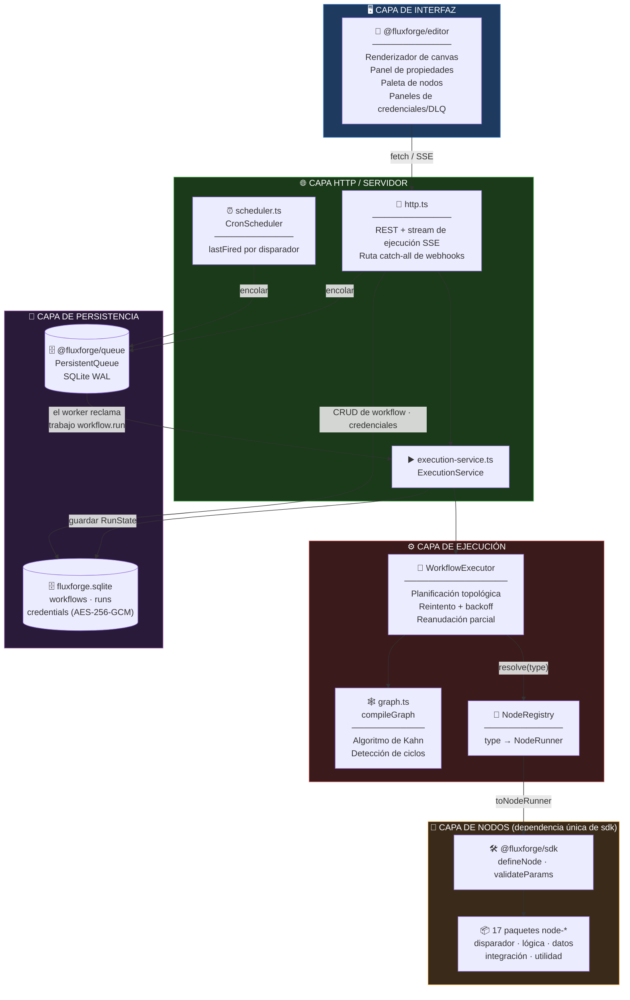
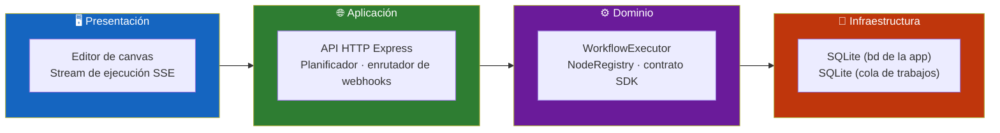
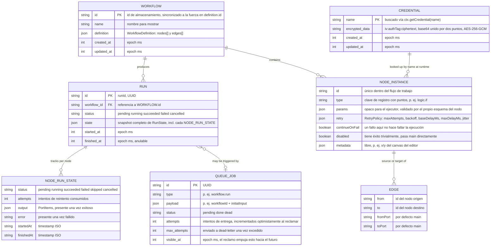
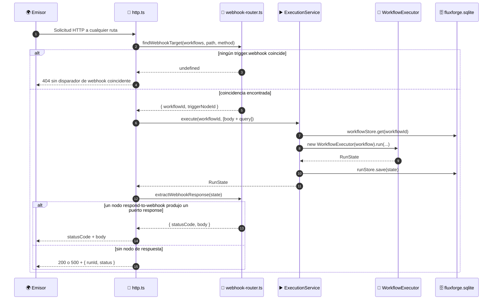
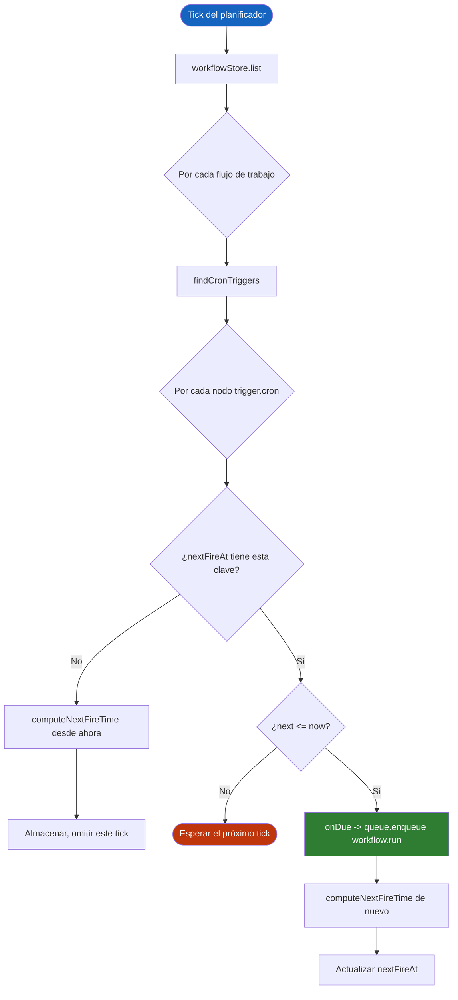
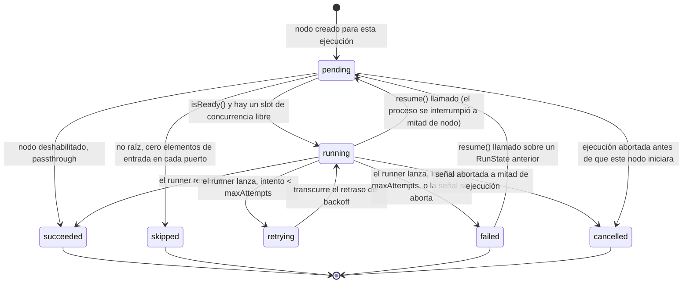
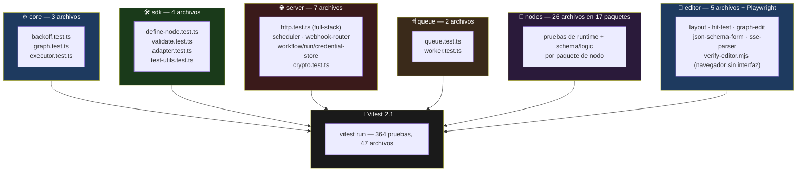

<div align="center">

**🌐 Choose Language / Selecione o Idioma / Elija el Idioma**

[](README.md)&nbsp;&nbsp;&nbsp;[](README_PT.md)&nbsp;&nbsp;&nbsp;[](README_ES.md)

</div>

---

<div align="center">

```
███████╗██╗     ██╗   ██╗██╗  ██╗███████╗ ██████╗ ██████╗  ██████╗ ███████╗
██╔════╝██║     ██║   ██║╚██╗██╔╝██╔════╝██╔═══██╗██╔══██╗██╔════╝ ██╔════╝
█████╗  ██║     ██║   ██║ ╚███╔╝ █████╗  ██║   ██║██████╔╝██║  ███╗█████╗
██╔══╝  ██║     ██║   ██║ ██╔██╗ ██╔══╝  ██║   ██║██╔══██╗██║   ██║██╔══╝
██║     ███████╗╚██████╔╝██╔╝ ██╗██║     ╚██████╔╝██║  ██║╚██████╔╝███████╗
╚═╝     ╚══════╝ ╚═════╝ ╚═╝  ╚═╝╚═╝      ╚═════╝ ╚═╝  ╚═╝ ╚═════╝ ╚══════╝
        Un motor de automatización de flujos de trabajo, escrito desde cero en TypeScript
```

---

[](https://www.typescriptlang.org/)
[](https://nodejs.org/)
[](https://vitest.dev/)
[](https://www.sqlite.org/)
[](https://expressjs.com/)
[](https://vitejs.dev/)
[](https://zod.dev/)
[](LICENSE)

<br/>

> **Un motor de automatización de flujos de trabajo de código abierto, escrito desde cero en TypeScript real.**
> Un ejecutor de DAG con reintento/backoff y reanudación parcial segura frente a fallos, una cola de trabajos persistente en SQLite, un SDK de nodos conectable, y un editor de canvas construido sin ninguna biblioteca de diagramación.

<br/>


</div>

---

## 📑 Tabla de Contenidos

<details>
<summary>▶️ <strong>Haga clic para expandir / contraer esta sección</strong></summary>

<table>
<tr>
<td valign="top" width="50%">

**🏗️ Sistema**
- [Visión General](#-visión-general)
- [Arquitectura del Sistema](#-arquitectura-del-sistema)
- [Stack Tecnológico](#-stack-tecnológico)
- [Patrones de Diseño](#-patrones-de-diseño-aplicados)
- [Estructura del Proyecto](#-estructura-del-proyecto)

**📦 Módulos**
- [Core — Ejecutor de DAG](#-fluxforgecore--ejecutor-de-dag)
- [SDK — Autoría de Nodos](#-fluxforgesdk--autoría-de-nodos)
- [Registry](#-fluxforgeregistry)
- [Queue — Trabajos Persistentes](#-fluxforgequeue--cola-de-trabajos-persistente)
- [Server](#-fluxforgeserver)
- [Editor](#-fluxforgeeditor)
- [Biblioteca de Nodos (17 paquetes)](#-biblioteca-de-nodos-17-paquetes)

</td>
<td valign="top" width="50%">

**💼 Negocio**
- [Reglas de Negocio](#-reglas-de-negocio)
- [Requisitos Funcionales](#-requisitos-funcionales)
- [Requisitos No Funcionales](#-requisitos-no-funcionales)

**📐 Diseño**
- [Modelo de Datos](#-modelo-de-datos)
- [Flujos del Sistema](#-flujos-del-sistema)

**🔐 Seguridad y Operaciones**
- [Seguridad](#-seguridad)
- [Instalación & Ejecución](#-instalación--ejecución)
- [Pruebas Automatizadas](#-pruebas-automatizadas)
- [Métricas & Monitoreo](#-métricas--monitoreo)
- [Limitaciones Conocidas](#-limitaciones-conocidas)

</td>
</tr>
</table>

---

</details>

## 🌟 Visión General

<details>
<summary>▶️ <strong>Haga clic para expandir / contraer esta sección</strong></summary>

**FluxForge** es un motor de automatización de flujos de trabajo de código abierto escrito desde cero en TypeScript. n8n y Zapier son los puntos de referencia de lo que hace, no dependencias: nada aquí está construido sobre ninguno de los dos. Ofrece un ejecutor de grafo acíclico dirigido con reintento y backoff exponencial, reanudación parcial segura frente a fallos, una cola de trabajos persistente respaldada por SQLite, un sistema de nodos conectable con un SDK real para terceros, y un editor visual basado en canvas construido sin una biblioteca de diagramación.

El repositorio es un monorepo de npm workspaces con 23 paquetes: `@fluxforge/core` (el ejecutor), `@fluxforge/queue` (la cola de trabajos), `@fluxforge/sdk` (el contrato de autoría de nodos), `@fluxforge/registry` (búsqueda de nodos), `@fluxforge/server` (la API HTTP, el planificador y el enrutador de webhooks), `@fluxforge/editor` (la interfaz del navegador), y 17 paquetes `@fluxforge/node-*` que proveen nodos de disparador, lógica, datos, integración y utilidad. Cada paquete que no es el editor ni el servidor no depende de nada más allá de `@fluxforge/core`, `@fluxforge/sdk` y `zod`, lo que mantiene la huella de instalación de un autor de nodos de terceros en una sola dependencia.

Un flujo de trabajo es un DAG estricto: nodos y aristas, sin ciclos. Un "bucle" es el comportamiento interno propio de un nodo, nunca la forma de un grafo, porque un grafo cíclico no tiene un orden topológico bien definido sobre el cual la lógica de reintento y reanudación parcial pueda razonar. Esa única decisión (documentada como [ADR-0002](docs/adr/0002-dag-not-cyclic-graph.md) en el código fuente) moldea casi todo lo demás en este README: el algoritmo de planificación del ejecutor, la regla de omisión de rama y la semántica de reanudación.

### 🎯 Objetivos del Sistema

| Objetivo | Descripción |
|-----------|-------------|
| ⚙️ **Ejecución determinista de DAG** | Ordenar topológicamente y ejecutar los nodos de un flujo de trabajo con concurrencia configurable, reintentando los nodos fallidos con backoff |
| 💾 **Reanudación parcial segura frente a fallos** | Persistir un `RunState` después de cada nodo para que una ejecución interrumpida o cancelada pueda continuar desde donde se detuvo, sin volver a ejecutar nunca el trabajo ya exitoso |
| 🔌 **Autoría de nodos de terceros** | Exponer `defineNode()` como todo el contrato que un nuevo paquete de integración necesita, con parámetros validados por zod |
| 📥 **Colas persistentes y recuperables ante fallos** | Ejecutar flujos de trabajo de forma asíncrona vía una cola de trabajos en SQLite usando un modelo de reclamo por tiempo de visibilidad, sin proceso de barrido de fallos separado |
| 🌐 **Automatización disparada por HTTP** | Recibir webhooks y disparar programaciones cron contra definiciones de flujo de trabajo almacenadas, con una API REST para todo lo demás |
| 🔐 **Almacenamiento de credenciales cifrado** | Almacenar tokens de API y secretos de terceros cifrados en reposo con AES-256-GCM |
| 🎨 **Autoría visual** | Permitir que una persona construya, conecte, ejecute e inspeccione un flujo de trabajo en un canvas con pan/zoom, sin ninguna biblioteca de diagramación externa |
| 🧪 **Corrección verificada** | Respaldar cada paquete con pruebas unitarias reales, además de una prueba de integración HTTP full-stack y una pasada end-to-end en navegador real |

---

</details>

## 🏗️ Arquitectura del Sistema

<details>
<summary>▶️ <strong>Haga clic para expandir / contraer esta sección</strong></summary>

### Diagrama de Módulos



### Capas de la Arquitectura



---

</details>

## 🛠️ Stack Tecnológico

<details>
<summary>▶️ <strong>Haga clic para expandir / contraer esta sección</strong></summary>

<table>
<thead>
<tr>
<th>Capa</th>
<th>Tecnología</th>
<th>Versión</th>
<th>Propósito</th>
</tr>
</thead>
<tbody>
<tr>
<td rowspan="3"><strong>🧠 Lenguaje</strong></td>
<td>TypeScript</td>
<td>^5.7.2</td>
<td>Modo estricto, referencias de proyecto (<code>tsc -b</code>), <code>verbatimModuleSyntax</code></td>
</tr>
<tr>
<td>Node.js</td>
<td>&gt;=20 (engines)</td>
<td>Runtime para el servidor, el worker de la cola y el planificador</td>
</tr>
<tr>
<td>ESM (<code>"type": "module"</code>)</td>
<td>—</td>
<td>Cada paquete del workspace, de manera uniforme</td>
</tr>
<tr>
<td rowspan="2"><strong>✅ Validación</strong></td>
<td>Zod</td>
<td>^4.4.3</td>
<td>Definiciones de <code>paramsSchema</code> de nodo, validadas en tiempo de ejecución por cada ejecución</td>
</tr>
<tr>
<td>JSON Schema (2020-12)</td>
<td>vía <code>z.toJSONSchema</code></td>
<td>Serializado al editor a través de <code>GET /api/nodes</code> para formularios impulsados por esquema</td>
</tr>
<tr>
<td rowspan="2"><strong>💾 Persistencia</strong></td>
<td>better-sqlite3</td>
<td>^13.0.3</td>
<td>Driver SQLite síncrono, modo de journal WAL, usado tanto por la bd de la app como por la de la cola</td>
</tr>
<tr>
<td>node:crypto</td>
<td>integrado</td>
<td>Cifrado de credenciales AES-256-GCM, generación de UUID</td>
</tr>
<tr>
<td rowspan="2"><strong>🌐 Servidor</strong></td>
<td>Express</td>
<td>^4.21.2</td>
<td>API REST, streaming de ejecuciones vía SSE, ruta catch-all de webhooks</td>
</tr>
<tr>
<td>tsx</td>
<td>^4.23.9</td>
<td>Modo watch sin compilación para <code>npm run dev:server</code></td>
</tr>
<tr>
<td rowspan="2"><strong>🎨 Editor</strong></td>
<td>Vite</td>
<td>^6.0.7</td>
<td>Servidor de desarrollo (puerto 5180, redirige <code>/api</code>) y build de producción</td>
</tr>
<tr>
<td>Canvas 2D API</td>
<td>integrado en el navegador</td>
<td>Renderizado del grafo de nodos — sin dependencia de biblioteca de diagramación</td>
</tr>
<tr>
<td rowspan="2"><strong>🔧 Build & Calidad</strong></td>
<td>Referencias de proyecto TypeScript</td>
<td><code>tsc -b tsconfig.json</code></td>
<td>Builds compuestos incrementales a través de los 23 workspaces</td>
</tr>
<tr>
<td>ESLint + typescript-eslint</td>
<td>^9.17 / ^8.19</td>
<td><code>eqeqeq</code>, sin <code>var</code>, imports de tipo consistentes, sin variables sin usar</td>
</tr>
<tr>
<td rowspan="2"><strong>🧪 Pruebas</strong></td>
<td>Vitest</td>
<td>^2.1.8</td>
<td>364 pruebas en 47 archivos, con alias de rutas por paquete del workspace</td>
</tr>
<tr>
<td>Playwright</td>
<td>^1.62.1</td>
<td>Pasada end-to-end sin interfaz gráfica que ejerce la UI real del editor</td>
</tr>
</tbody>
</table>

---

</details>

## 🎨 Patrones de Diseño Aplicados

<details>
<summary>▶️ <strong>Haga clic para expandir / contraer esta sección</strong></summary>

| Patrón | Dónde | Justificación |
|---------|-------|-----------|
| 🏭 **Función Factory** | `defineNode()` en `packages/sdk/src/define-node.ts` | Valida y congela una `NodeDefinition` en tiempo de autoría, de modo que un nodo malformado falle en la propia suite de pruebas del autor, no en medio de una ejecución |
| 🔌 **Adapter** | `toNodeRunner()` en `packages/sdk/src/adapter.ts` | Conecta la `NodeDefinition` tipada del SDK con la función `NodeRunner` no tipada del core — el único lugar donde ambas formas se encuentran |
| 📇 **Registry** | `NodeRegistry` en `packages/registry/src/registry.ts` | Recolecta definiciones de nodos incorporados y de terceros y las expone como un `NodeRunnerResolver`, sin ninguna opinión sobre qué nodos existen |
| 🔁 **Strategy** | `NodeRunnerResolver.resolve(type)` en `packages/core/src/types.ts` | Al ejecutor se le entrega una interfaz resolver; nunca sabe si un tipo mapea a un runner incorporado o de terceros |
| 📡 **Observer / pub-sub** | `RunEventBus` en `packages/core/src/events.ts` | Un conjunto mínimo de listeners tipados por ejecución, conectado 1:1 a Server-Sent Events por `http.ts` |
| ⏳ **Reclamo por tiempo de visibilidad** | `PersistentQueue.claim()` en `packages/queue/src/queue.ts` | La recuperación ante fallos surge del propio modelo de reclamo (`visible_at` expirado), sin necesidad de un proceso de barrido de latidos separado |
| 🧱 **Objetos de comando inmutables** | `graph-edit.ts` en `packages/editor/src/graph-edit.ts` | Cada edición devuelve una nueva `WorkflowDefinition` en lugar de mutar una, lo que hace trivial el deshacer/rehacer |
| 🚦 **Guard clause / fallo rápido** | `compileGraph()` en `packages/core/src/graph.ts`, `getEncryptionKey()` en `packages/server/src/crypto.ts` | IDs de nodo duplicados, aristas colgantes, ciclos, y una clave de cifrado faltante lanzan de inmediato en lugar de degradarse silenciosamente |
| 🧩 **Inyección de dependencias** | `ExecutorOptions` (`now`, `random`, `sleep`) en `packages/core/src/executor.ts` | Reloj, RNG y sleep son inyectables, lo que hace que las pruebas de temporización de reintentos sean exactas en lugar de "eventualmente, probablemente" |

---

</details>

## 📁 Estructura del Proyecto

<details>
<summary>▶️ <strong>Haga clic para expandir / contraer esta sección</strong></summary>

```
fluxforge/
│
├── 📄 package.json                    # Manifiesto raíz de workspaces, scripts npm (build/test/lint/check)
├── 📄 tsconfig.json                   # Raíz de referencias de proyecto — una entrada por paquete del workspace
├── 📄 tsconfig.base.json              # Opciones de compilador estrictas compartidas (ES2022, verbatimModuleSyntax)
├── 📄 vitest.config.ts                # Alias de rutas por workspace + alias node-* autodescubiertos
├── 📄 eslint.config.js                # Configuración flat de typescript-eslint (eqeqeq, no-var, ...)
│
├── 📂 docs/
│   └── 📂 adr/                        # Registros de Decisiones de Arquitectura (ADR-0002..0005 referenciados abajo)
│
├── 📂 examples/
│   ├── 📄 README.md                   # Cómo cargar los dos flujos de trabajo de ejemplo
│   ├── 📄 webhook-echo.json           # ida y vuelta trigger.webhook -> respond-to-webhook
│   └── 📄 scheduled-slack-digest.json # cadena trigger.cron -> rss-read -> slack-webhook
│
├── 📂 scripts/
│   ├── 📄 scaffold-node.mjs           # `npm run scaffold:node` — genera un nuevo paquete de nodo
│   └── 📄 verify-editor.mjs           # Driver end-to-end de Playwright para el editor
│
├── 📂 packages/
│   ├── 📂 core/                       # @fluxforge/core — tipos DAG, compilador de grafo, ejecutor, backoff
│   │   └── 📂 src/
│   │       ├── 📄 types.ts            # WorkflowDefinition, NodeInstance, RunState, RunEvent, ...
│   │       ├── 📄 graph.ts            # compileGraph — algoritmo de Kahn + detección de ciclos
│   │       ├── 📄 executor.ts         # WorkflowExecutor — run() / resume()
│   │       ├── 📄 backoff.ts          # calculateBackoffDelay — fijo/exponencial + jitter
│   │       └── 📄 events.ts           # RunEventBus — pub/sub tipado por ejecución
│   │
│   ├── 📂 sdk/                        # @fluxforge/sdk — defineNode() y todo el contrato de autoría
│   ├── 📂 registry/                   # @fluxforge/registry — NodeRegistry, fábrica de NodeRunnerResolver
│   ├── 📂 queue/                      # @fluxforge/queue — PersistentQueue (SQLite), QueueWorker
│   ├── 📂 server/                     # @fluxforge/server — API HTTP, planificador, credenciales, webhooks
│   │   └── 📂 src/
│   │       ├── 📄 http.ts             # App Express: REST + SSE + ruta catch-all de webhooks
│   │       ├── 📄 main.ts             # Arranque real — conecta bd, cola, planificador, registry, http
│   │       ├── 📄 scheduler.ts        # CronScheduler — sondeo de lastFired por disparador
│   │       ├── 📄 crypto.ts           # cifrado/descifrado AES-256-GCM
│   │       ├── 📄 credential-store.ts # CRUD de credenciales cifradas en reposo
│   │       ├── 📄 webhook-router.ts   # findWebhookTarget / extractWebhookResponse
│   │       ├── 📄 workflow-store.ts   # CRUD de flujos de trabajo sobre SQLite
│   │       ├── 📄 run-store.ts        # Persistencia de RunState
│   │       ├── 📄 execution-service.ts# Une registry + stores en execute()/resume()
│   │       ├── 📄 builtins.ts         # El único archivo que importa cada paquete node-*
│   │       └── 📄 db.ts               # openDb — esquema de workflows/runs/credentials
│   │
│   ├── 📂 editor/                     # @fluxforge/editor — el editor visual basado en canvas
│   │   └── 📂 src/
│   │       ├── 📄 app.ts              # EditorApp — controlador que conecta DOM/canvas a graph-edit
│   │       ├── 📄 canvas.ts           # render() que dibuja píxeles — lee la geometría pura de layout.ts
│   │       ├── 📄 layout.ts           # Geometría pura de nodo/puerto/arista, testeable como unidad
│   │       ├── 📄 hit-test.ts         # Pruebas de impacto puras para puertos/aristas/cuerpos de nodo
│   │       ├── 📄 graph-edit.ts       # Transformaciones puras e inmutables de WorkflowDefinition
│   │       ├── 📄 api-client.ts       # Wrapper de fetch tipado sobre la superficie REST + SSE del servidor
│   │       ├── 📄 json-schema-form.ts # JSON Schema -> descriptores de campo de formulario
│   │       ├── 📄 property-panel.ts   # Formulario de propiedades de nodo impulsado por esquema
│   │       ├── 📄 node-palette.ts     # Lista lateral de tipos de nodo registrados por categoría
│   │       ├── 📄 credentials-panel.ts# Modal sobre /api/credentials
│   │       ├── 📄 dead-letter-panel.ts# Modal sobre /api/dead-letter + requeue
│   │       └── 📄 sse-parser.ts       # Parser puro de fragmentos SSE (cuerpo de fetch, no EventSource)
│   │
│   └── 📂 nodes/                      # 17 paquetes @fluxforge/node-*, cada uno: package.json, src/schema.ts, src/runtime.ts
│       ├── 📂 manual/  📂 cron/  📂 webhook/            # categoría trigger
│       ├── 📂 if/  📂 switch/  📂 filter/               # categoría logic
│       ├── 📂 set/  📂 aggregate/  📂 code/             # categoría data
│       ├── 📂 http-request/                             # categoría action
│       ├── 📂 slack-webhook/  📂 discord-webhook/
│       │   📂 github-issue/  📂 rss-read/
│       │   📂 google-sheets-append/                     # categoría integration
│       └── 📂 no-op/  📂 respond-to-webhook/             # categoría utility
│
├── 📄 README.md                       # 🇺🇸 Inglés (primario)
├── 📄 README_PT.md                    # 🇧🇷 Português
└── 📄 README_ES.md                    # 🇪🇸 Español
```

---

</details>

## 📦 Módulos del Sistema

<details>
<summary>▶️ <strong>Haga clic para expandir / contraer esta sección</strong></summary>

### ⚙️ `@fluxforge/core` — Ejecutor de DAG

Los tipos DAG, la compilación de grafo, el ejecutor, el reintento/backoff, y la reanudación de ejecución parcial. No depende de nada más en el monorepo.

| Responsabilidad | Implementación |
|-----------------|-----------------|
| Validación e indexación de grafo | `compileGraph()` — IDs de nodo duplicados, aristas colgantes y ciclos, todos lanzan `GraphValidationError` |
| Ordenamiento topológico | `topologicalSort()` — algoritmo de Kahn; una cola sobrante no vacía es un certificado directo de ciclo |
| Planificación | `WorkflowExecutor.execute()` — ejecuta nodos listos hasta `concurrency` (predeterminado 4) de forma concurrente vía `Promise.race` |
| Cascada de omisión de rama | Un nodo no raíz con cero elementos de entrada reunidos en cada puerto se marca `skipped`, no se ejecuta — sin lógica especial de nodo de rama en ningún lado |
| Reintento con backoff | `calculateBackoffDelay(attempt, policy, random)` — fijo o exponencial, limitado por `maxDelayMs` antes de aplicar jitter |
| Reanudación parcial | `WorkflowExecutor.resume(previous)` — los nodos `succeeded`/`skipped` se reutilizan tal cual; los nodos `running`/`failed` se restablecen a `pending`, intento 1 |
| Emisión de eventos | `RunEventBus` — `run.started/succeeded/failed/cancelled`, `node.started/succeeded/retrying/failed/skipped` |

---

### 🛠️ `@fluxforge/sdk` — Autoría de Nodos

Todo el contrato de autoría de nodos para terceros: `defineNode()`, parámetros validados por zod, un adaptador de `NodeDefinition` a `NodeRunner`, y utilidades de prueba. Depende solo de `@fluxforge/core` y `zod`.

| Responsabilidad | Implementación |
|-----------------|-----------------|
| Validación de definición | `defineNode()` — impone un `type` en minúsculas separado por puntos (`TYPE_PATTERN`), `displayName`/`description` no vacíos, IDs de puerto únicos |
| Validación de parámetros | `validateParams()` — parsea los parámetros crudos contra `paramsSchema` por cada ejecución (no por guardado), ya que un parámetro puede resolverse de forma distinta entre ejecuciones |
| Puente con core | `toNodeRunner(def, credentials)` — el único lugar donde una `NodeDefinition` se convierte en un `NodeRunner` plano que el core puede llamar |
| Búsqueda de credenciales | `CredentialResolver.getCredential(name)` — inyectado por resolver; por defecto usa un resolver sin operación cuando se omite |
| Utilidades de prueba | `createTestContext()`, `runNode()` — construyen un `NodeContext` y ejecutan un nodo exactamente como lo hace el ejecutor real, sin importar el ejecutor |

---

### 📇 `@fluxforge/registry`

Recolecta `NodeDefinition`s (incorporadas o de terceros) y las expone como un `NodeRunnerResolver` para el ejecutor y un listado para la paleta del editor. Depende de core y sdk.

| Método | Comportamiento |
|--------|----------|
| `register(def)` | Lanza `DuplicateNodeTypeError` si `def.type` ya está registrado |
| `registerAll(defs)` | Conveniencia usada por `builtins.ts` para registrar los 17 nodos incorporados de una vez |
| `list()` | Cada definición registrada — lo que respalda `GET /api/nodes` y la paleta del editor |
| `createResolver(credentials?)` | Devuelve un `NodeRunnerResolver` ligado a un resolver de credenciales, cacheando resultados de `toNodeRunner` por tipo |

---

### 🗄️ `@fluxforge/queue` — Cola de Trabajos Persistente

Una cola de trabajos persistente sobre SQLite (`better-sqlite3`): reclamos por tiempo de visibilidad, reintentos programados con backoff, dead-lettering, y un pequeño worker de bucle de sondeo.

| Método | Comportamiento |
|--------|----------|
| `enqueue(type, payload, options)` | Inserta un trabajo `pending`; `visible_at` toma por defecto el momento actual más `delayMs` |
| `claim(visibilityTimeoutMs, type?)` | Se ejecuta dentro de `BEGIN IMMEDIATE` (no diferida) para que dos procesos que comparten un archivo nunca reclamen doble; envía automáticamente a dead-letter un trabajo cuyo próximo intento excedería `maxAttempts` |
| `complete(jobId)` | Marca un trabajo reclamado como `done` |
| `fail(jobId, error, policy?)` | Reprograma con `calculateBackoffDelay` si quedan intentos, si no lo marca `dead` |
| `release(jobId)` | Deshace el incremento optimista de intento para un apagado ordenado, distinto de un fallo real |
| `deadLetter()` / `requeue(jobId)` | Lista y restablece trabajos en dead-letter a un ciclo de intento `pending` nuevo |
| `QueueWorker` | Un bucle de sondeo `claim → handler → complete/fail`; `stop()` deja que el trabajo en curso termine en lugar de abortarlo |

---

### 🌐 `@fluxforge/server`

El servidor HTTP que une todo: CRUD de flujos de trabajo, ejecución directa y encolada, recepción de webhooks, planificación cron, y almacenamiento de credenciales cifrado en reposo.

| Componente | Archivo | Responsabilidad |
|-----------|------|-----------------|
| Base de datos | `db.ts` | Un archivo SQLite (tablas `workflows`, `runs`, `credentials`), separado del propio archivo de bd de la cola |
| Almacén de flujos | `workflow-store.ts` | `save()` fuerza `definition.id` al id de almacenamiento para que `RunState.workflowId` nunca pueda discrepar con la clave de búsqueda |
| Almacén de ejecuciones | `run-store.ts` | Persiste cada `RunState`, lo que hace que el historial de ejecuciones sobreviva a un reinicio y que `resume()` sea localizable |
| Almacén de credenciales | `credential-store.ts` + `crypto.ts` | AES-256-GCM (`node:crypto`), clave desde `FLUXFORGE_CREDENTIALS_KEY` (32 bytes, base64) |
| Servicio de ejecución | `execution-service.ts` | Construye un `WorkflowExecutor` por llamada, espera la ejecución, persiste el resultado |
| Enrutador de webhooks | `webhook-router.ts` | `findWebhookTarget()` recorre linealmente los flujos de trabajo almacenados buscando un nodo `trigger.webhook` coincidente; `extractWebhookResponse()` lee el primer puerto `response` en una ejecución finalizada |
| Planificador | `scheduler.ts` | `CronScheduler` sondea cada nodo `trigger.cron`, rastreando un `lastFired` por disparador para que un flujo de trabajo recién añadido no dispare por el tiempo que "se perdió" |
| App HTTP | `http.ts` | App Express: `/api/nodes`, `/api/workflows*`, `/api/runs/:id`, `/api/credentials*`, `/api/dead-letter*`, más una ruta catch-all de webhooks |
| Arranque | `main.ts` | El único archivo que conecta bd, almacenes, registry, worker de cola, planificador y app HTTP entre sí |

---

### 🎨 `@fluxforge/editor`

El editor visual de flujos de trabajo basado en el navegador: un grafo de nodos en canvas, un panel de propiedades impulsado por esquema, y estado de ejecución en vivo. Depende solo de core y sdk (para los tipos).

| Componente | Archivo | Responsabilidad |
|-----------|------|-----------------|
| Controlador | `app.ts` | `EditorApp` — posee el estado mutable del editor, conecta eventos de DOM/canvas a las funciones puras de `graph-edit.ts` |
| Renderizador | `canvas.ts` | Dibujo de píxeles deliberadamente sin pruebas; todo lo que dibuja (posiciones, impactos) se decide en otro lugar |
| Geometría | `layout.ts` | Geometría pura de nodo/puerto/arista: `computeNodeLayout`, `bezierControlOffset`, `resolveEdgeEndpoints` |
| Pruebas de impacto | `hit-test.ts` | Pruebas puras de impacto en puerto/arista/cuerpo de nodo, con tolerancia dividida por el zoom actual |
| Ediciones de grafo | `graph-edit.ts` | Transformaciones puras e inmutables de `WorkflowDefinition` — `addNode`, `removeEdge`, `updateNodeParams`, ... |
| Cliente API | `api-client.ts` | Wrapper de `fetch` tipado para la superficie REST más streaming de ejecuciones vía SSE |
| Formularios de esquema | `json-schema-form.ts` | Lee el JSON Schema de un nodo (draft 2020-12, tal como lo emite `z.toJSONSchema`) en descriptores de campo de formulario |
| Panel de propiedades | `property-panel.ts` | Reconstruye un formulario desde cero por cada `show()` a partir del esquema del nodo seleccionado |
| Paleta de nodos | `node-palette.ts` | Lista lateral de tipos de nodo registrados, agrupados por categoría |
| Panel de credenciales | `credentials-panel.ts` | Modal sobre `/api/credentials`; muestra solo nombres, los valores nunca salen del servidor |
| Panel de dead-letter | `dead-letter-panel.ts` | Modal que lista `PersistentQueue.deadLetter()` con una acción de reencolado |
| Parser SSE | `sse-parser.ts` | `parseSseChunk()` puro para SSE sobre el cuerpo de `fetch()`, ya que `EventSource` no puede emitir el `POST` que el inicio de una ejecución necesita |

---

### 🧩 Biblioteca de Nodos (17 paquetes)

Cada paquete de nodo no depende de nada más que `@fluxforge/sdk` (y `zod`, de forma transitiva). Cada uno exporta un resultado de `defineNode()` desde `src/runtime.ts`, validado por `src/schema.ts`.

| Tipo | Categoría | Paquete | Comportamiento |
|------|----------|---------|----------|
| `trigger.manual` | trigger | `node-manual` | Pasa directamente el `initialInput` sembrado de la ejecución — el disparador predeterminado con el que empieza todo flujo de trabajo nuevo |
| `trigger.cron` | trigger | `node-cron` | Emite `{ firedAt }` al ser invocado; `CronScheduler` decide *cuándo* vía `nextFireTime(expression, after)` (cron de 5 campos solo UTC) |
| `trigger.webhook` | trigger | `node-webhook` | Solo declarativo — los parámetros `path`/`method` los compara `findWebhookTarget` contra las solicitudes entrantes; `run()` pasa directo |
| `logic.if` | logic | `node-if` | Divide los elementos individualmente en puertos `true`/`false` según una condición de campo/operador/valor |
| `logic.switch` | logic | `node-switch` | Enruta cada elemento a uno de cinco puertos fijos `case-0`..`case-4` (igualdad estricta) o `default` |
| `logic.filter` | logic | `node-filter` | Conserva solo los elementos coincidentes en un único puerto `main`, descartando el resto |
| `data.set` | data | `node-set` | Elimina campos, luego aplica las anulaciones de `set` — `remove` antes que `set` para que un campo reasignado nunca se elimine de nuevo |
| `data.aggregate` | data | `node-aggregate` | Reduce elementos a un único elemento resumen (o uno por valor de `groupBy`): suma/conteo/promedio/mín/máx sobre un campo numérico |
| `data.code` | data | `node-code` | Evalúa una expresión JS por elemento vía `new Function` — sin sandbox, con privilegios completos del proceso, solo para flujos de trabajo autoescritos |
| `action.http-request` | action | `node-http-request` | Realiza fetch por elemento (o una sola vez) con timeout (`AbortController`, 10s por defecto), credencial bearer opcional, alternador `ignoreHttpErrors` |
| `integration.slack-webhook` | integration | `node-slack-webhook` | Publica `text`/`channel`/`username` a una URL de Slack Incoming Webhook |
| `integration.discord-webhook` | integration | `node-discord-webhook` | Publica `content`/`username` a una URL de webhook de Discord |
| `integration.github-issue` | integration | `node-github-issue` | Crea un issue de GitHub vía la API REST; requiere una credencial `github` con un campo `token` |
| `integration.rss-read` | integration | `node-rss-read` | Obtiene y parsea un feed RSS/Atom en elementos `title`/`link`/`publishedAt` (nodo raíz, sin entradas) |
| `integration.google-sheets-append` | integration | `node-google-sheets-append` | Añade una fila vía la API v4 de Sheets `values.append`; requiere una credencial `google` con un `token` OAuth2 |
| `utility.no-op` | utility | `node-no-op` | Pasa `main` sin cambios — un marcador de posición para un flujo de trabajo aún en construcción |
| `utility.respond-to-webhook` | utility | `node-respond-to-webhook` | Declara el estado HTTP/cuerpo con el que una ejecución disparada por webhook debe responder; lo lee `webhook-router.ts`, nunca se conecta aguas abajo |

---

</details>

## 💼 Reglas de Negocio

<details>
<summary>▶️ <strong>Haga clic para expandir / contraer esta sección</strong></summary>

### 🕸️ Reglas de Forma del Grafo

| # | Regla | Cumplimiento |
|---|------|-------------|
| RN-01 | Los IDs de nodo de un flujo de trabajo deben ser únicos | `compileGraph()` lanza `GraphValidationError` ante un duplicado |
| RN-02 | Cada arista debe referenciar IDs de nodo existentes en ambos extremos | `compileGraph()` lanza ante un `from`/`to` colgante |
| RN-03 | Un grafo de flujo de trabajo no debe contener ciclos | La verificación de cola sobrante de `topologicalSort()` lanza, nombrando los nodos atascados |
| RN-04 | Un "bucle" es el comportamiento propio en tiempo de ejecución de un nodo, nunca la forma de un grafo | No existe ningún constructo de grafo cíclico en `@fluxforge/core` (ADR-0002) |

### ▶️ Reglas de Ejecución

| # | Regla | Cumplimiento |
|---|------|-------------|
| RN-05 | Un nodo solo se vuelve elegible una vez que todos los predecesores alcanzan un estado terminal | `isReady()` en `executor.ts` |
| RN-06 | Un nodo no raíz con cero elementos de entrada reunidos en cada puerto se omite, no se ejecuta | La regla genérica de omisión por entrada vacía, sin caso especial para nodos de rama |
| RN-07 | Un predecesor `failed` o `skipped` contribuye cero elementos aguas abajo | `gatherInput()` solo lee de fuentes `succeeded` |
| RN-08 | Un nodo cuyo tipo no tiene runner registrado hace fallar la ejecución (a menos que `continueOnFail`) | La rama de resolver ausente de `runOneNode()` |
| RN-09 | Un nodo deshabilitado tiene éxito trivialmente, pasando su entrada `main` directamente | Rama `if (node.disabled)` en `runOneNode()` |
| RN-10 | Los reintentos consumen el presupuesto propio de `maxAttempts` del nodo; una interrupción del proceso a mitad de nodo no lo hace | `resume()` restablece los nodos `running` a `pending`, intento 1 |

### 🗄️ Reglas de la Cola

| # | Regla | Cumplimiento |
|---|------|-------------|
| RN-11 | El `attempts` de un trabajo cuenta intentos de entrega, no ejecuciones completadas | Incrementado optimistamente dentro de `claim()`, antes de que se ejecute el handler |
| RN-12 | Un trabajo cuya próxima entrega excedería `maxAttempts` se envía a dead-letter por el propio camino de reclamo | Rama `nextAttempts > row.max_attempts` de `claim()`, sin barrido separado |
| RN-13 | Dos procesos que comparten un archivo SQLite nunca deben reclamar doblemente el mismo trabajo | `claim()` se ejecuta dentro de `BEGIN IMMEDIATE`, no una transacción diferida |
| RN-14 | Un apagado ordenado del worker no debe contar como un fallo de entrega | `release()` decrementa el incremento optimista de `attempts` |

### 🔐 Reglas de Credenciales y Servidor

| # | Regla | Cumplimiento |
|---|------|-------------|
| RN-15 | El `definition.id` de un flujo de trabajo almacenado debe ser siempre igual a su id de almacenamiento | `WorkflowStore.save()` sobrescribe a la fuerza `definition.id` |
| RN-16 | Los valores de credenciales nunca son devueltos por el endpoint de listado | `GET /api/credentials` devuelve `credentialStore.list()` (solo nombres) |
| RN-17 | El servidor debe negarse a iniciar sin una clave de cifrado válida de 32 bytes | `getEncryptionKey()` lanza `MissingEncryptionKeyError` |

---

</details>

## ✅ Requisitos Funcionales

<details>
<summary>▶️ <strong>Haga clic para expandir / contraer esta sección</strong></summary>

| ID | Requisito | Prioridad | Estado |
|----|-------------|----------|--------|
| **RF-01** | El sistema debe compilar una definición de flujo de trabajo en un grafo indexado y validado | 🔴 Alta | ✅ Implementado |
| **RF-02** | El sistema debe detectar y rechazar grafos de flujo de trabajo cíclicos | 🔴 Alta | ✅ Implementado |
| **RF-03** | El sistema debe ejecutar los nodos listos concurrentemente hasta un límite configurable | 🔴 Alta | ✅ Implementado |
| **RF-04** | El sistema debe reintentar un nodo fallido con backoff fijo o exponencial y jitter | 🔴 Alta | ✅ Implementado |
| **RF-05** | El sistema debe omitir un nodo no raíz que recibe cero elementos de entrada | 🔴 Alta | ✅ Implementado |
| **RF-06** | El sistema debe persistir un `RunState` una vez completada la ejecución | 🔴 Alta | ✅ Implementado |
| **RF-07** | El sistema debe reanudar una ejecución previa sin volver a ejecutar nodos exitosos | 🔴 Alta | ✅ Implementado |
| **RF-08** | El sistema debe permitir que un paquete de terceros defina un nodo vía `defineNode()` | 🔴 Alta | ✅ Implementado |
| **RF-09** | El sistema debe validar los parámetros de un nodo contra su propio esquema zod en cada ejecución | 🔴 Alta | ✅ Implementado |
| **RF-10** | El sistema debe exponer cada tipo de nodo registrado a través de `GET /api/nodes` con un JSON Schema | 🟡 Media | ✅ Implementado |
| **RF-11** | El sistema debe persistir trabajos en una cola duradera respaldada por SQLite | 🔴 Alta | ✅ Implementado |
| **RF-12** | El sistema debe recuperar el trabajo de un worker interrumpido una vez que expire su tiempo de visibilidad | 🔴 Alta | ✅ Implementado |
| **RF-13** | El sistema debe enviar a dead-letter un trabajo que agote su presupuesto de reintentos y permitir reencolarlo | 🟡 Media | ✅ Implementado |
| **RF-14** | El sistema debe aceptar CRUD de flujos de trabajo vía una API REST | 🔴 Alta | ✅ Implementado |
| **RF-15** | El sistema debe transmitir eventos de ejecución en vivo vía Server-Sent Events | 🟡 Media | ✅ Implementado |
| **RF-16** | El sistema debe enrutar una solicitud HTTP entrante hacia un nodo `trigger.webhook` coincidente | 🔴 Alta | ✅ Implementado |
| **RF-17** | El sistema debe responder a una ejecución disparada por webhook usando la salida de un nodo `respond-to-webhook` | 🟡 Media | ✅ Implementado |
| **RF-18** | El sistema debe disparar nodos `trigger.cron` según una expresión cron de 5 campos | 🔴 Alta | ✅ Implementado |
| **RF-19** | El sistema debe almacenar credenciales cifradas en reposo con AES-256-GCM | 🔴 Alta | ✅ Implementado |
| **RF-20** | El sistema nunca debe devolver el valor de una credencial desde el endpoint de listado | 🔴 Alta | ✅ Implementado |
| **RF-21** | El sistema debe permitir que un usuario construya y edite visualmente un flujo de trabajo en un canvas con pan/zoom | 🔴 Alta | ✅ Implementado |
| **RF-22** | El sistema debe renderizar un formulario de propiedades impulsado por esquema para el nodo seleccionado | 🟡 Media | ✅ Implementado |
| **RF-23** | El sistema debe permitir que un usuario ejecute un flujo de trabajo desde el editor y vea el estado de nodo en vivo | 🟡 Media | ✅ Implementado |
| **RF-24** | El sistema debe permitir que un usuario gestione credenciales y trabajos en dead-letter desde la UI del editor | 🟢 Baja | ✅ Implementado |
| **RF-25** | El sistema debe generar el andamiaje de un nuevo paquete de nodo vía un comando de CLI | 🟢 Baja | ✅ Implementado |

---

</details>

## ⚡ Requisitos No Funcionales

<details>
<summary>▶️ <strong>Haga clic para expandir / contraer esta sección</strong></summary>

| ID | Categoría | Requisito | Objetivo |
|----|----------|-------------|--------|
| **RNF-01** | ⚡ Rendimiento | Ruta caliente de búsqueda de nodo del ejecutor | Búsquedas `Map` en O(1), indexadas una vez por ejecución por `compileGraph()` |
| **RNF-02** | ⚡ Rendimiento | Concurrencia de ejecución predeterminada | 4 nodos concurrentes (`ExecutorOptions.concurrency`) |
| **RNF-03** | 🔐 Seguridad | Cifrado de credenciales | AES-256-GCM, clave de 32 bytes desde `FLUXFORGE_CREDENTIALS_KEY` |
| **RNF-04** | 🔐 Seguridad | Arranque del servidor sin clave de cifrado | Debe fallar rápido (`MissingEncryptionKeyError`), nunca iniciar sin cifrar |
| **RNF-05** | 🧱 Confiabilidad | Seguridad de reclamo de cola entre procesos | Transacción `BEGIN IMMEDIATE`, nunca una diferida |
| **RNF-06** | 🧱 Confiabilidad | Recuperación ante fallos | Surge del modelo de tiempo de visibilidad; sin proceso de barrido separado |
| **RNF-07** | 🧪 Testabilidad | Determinismo de temporización del ejecutor | `now`, `random`, `sleep` todos inyectables en `ExecutorOptions` |
| **RNF-08** | 🧪 Testabilidad | Tamaño y tasa de aprobación de la suite de pruebas | 364 pruebas, 47 archivos, 100% aprobadas al momento de escribir esto |
| **RNF-09** | 🧩 Extensibilidad | Huella de dependencias de nodo de terceros | Solo `@fluxforge/sdk` + `zod`, nunca core/queue/server/editor |
| **RNF-10** | 🧩 Extensibilidad | Tiempo de andamiaje de nuevo nodo | Un comando de CLI (`npm run scaffold:node`) genera el diseño completo de archivos |
| **RNF-11** | 🔧 Mantenibilidad | Sistema de build | Referencias de proyecto `tsc -b` a través de 23 paquetes compuestos |
| **RNF-12** | 🔧 Mantenibilidad | Disciplina de lint | `eqeqeq`, sin `var`, sin variables sin usar, imports de solo-tipo consistentes forzados |
| **RNF-13** | 📦 Portabilidad | Dependencia de runtime | Node.js >=20, sin paso de compilación nativo más allá del binario precompilado de `better-sqlite3` |
| **RNF-14** | 🌐 Compatibilidad | Requisito de navegador del editor | Cualquier navegador con Canvas 2D y `fetch`; ninguna característica de runtime específica de un bundler |
| **RNF-15** | 📈 Escalabilidad (declarado, honesto) | Coincidencia de rutas de webhook | Escaneo lineal sobre los nodos de los flujos de trabajo almacenados — explícitamente aceptable a escala autoalojada, no indexado |
| **RNF-16** | ♿ Usabilidad | Seguridad de la UI de credenciales | Los valores nunca se renderizan ni se transmiten de vuelta al navegador una vez establecidos |

---

</details>

## 🗄️ Modelo de Datos

<details>
<summary>▶️ <strong>Haga clic para expandir / contraer esta sección</strong></summary>

FluxForge persiste en dos archivos SQLite separados (`db.ts` para la aplicación, `queue.ts` para los trabajos), mantenidos deliberadamente aparte ya que el paquete de la cola no tiene idea de qué es un "flujo de trabajo".

### Diagrama Entidad-Relación



### Esquema de la Base de Datos de la Aplicación (`fluxforge.sqlite`)

| Tabla | Columnas clave | Notas |
|-------|-------------|-------|
| `workflows` | `id` (PK), `name`, `definition` (texto JSON), `created_at`, `updated_at` | `definition.id` siempre se sincroniza a la fuerza con `id` al guardar |
| `runs` | `id` (PK), `workflow_id`, `status`, `state` (texto JSON), `started_at`, `finished_at` | Indexada por `(workflow_id, started_at DESC)` para `listForWorkflow` |
| `credentials` | `name` (PK), `encrypted_data`, `created_at`, `updated_at` | `encrypted_data` nunca se descifra fuera de `CredentialStore.getCredential` |

### Esquema de la Base de Datos de la Cola (`fluxforge-queue.sqlite`)

| Columna | Tipo | Notas |
|--------|------|-------|
| `id`, `type`, `payload` | TEXT | `payload` es texto JSON |
| `status` | TEXT | `pending` \| `done` \| `dead` |
| `attempts`, `max_attempts` | INTEGER | Un contador de entregas, no un contador de ejecuciones completadas |
| `backoff_kind`, `base_delay_ms`, `max_delay_ms` | TEXT / INTEGER | Alimenta a `calculateBackoffDelay` en `fail()` |
| `visible_at` | INTEGER | Indexada junto con `status` para la consulta de `claim()` |

---

</details>

## 🔄 Flujos del Sistema

<details>
<summary>▶️ <strong>Haga clic para expandir / contraer esta sección</strong></summary>

### Flujo de Ejecución Disparado por Webhook



### Flujo de Planificación Cron



### Máquina de Estados de Ejecución y Reintento de Nodo



---

</details>

## 🔐 Seguridad

<details>
<summary>▶️ <strong>Haga clic para expandir / contraer esta sección</strong></summary>

### Controles Implementados

| Control | Implementación | Efecto |
|---------|-----------------|--------|
| 🔐 **Cifrado de credenciales en reposo** | AES-256-GCM vía `node:crypto` en `crypto.ts`, clave desde `FLUXFORGE_CREDENTIALS_KEY` | Un archivo SQLite robado no puede leerse sin la clave de 32 bytes |
| 🚫 **Fallo rápido ante clave faltante** | `getEncryptionKey()` lanza `MissingEncryptionKeyError` si la variable de entorno no está definida o es inválida | El servidor nunca arranca silenciosamente sin cifrar |
| 🔏 **Cifrado autenticado** | El `authTag` de AES-GCM se verifica en cada `decrypt()` | Un texto cifrado alterado falla al descifrar en lugar de devolver texto plano corrupto |
| 🙈 **Valores de credenciales nunca listados** | `GET /api/credentials` devuelve `credentialStore.list()` — solo nombres | El panel de credenciales del editor no puede filtrar un valor aunque lo intentara |
| 🔀 **IV aleatorio por cifrado** | `randomBytes(12)` generado de nuevo en cada llamada a `encrypt()` | Dos secretos idénticos nunca producen el mismo texto cifrado |
| ✅ **Parámetros validados por ejecución** | `validateParams()` ejecuta `def.paramsSchema.safeParse` antes de cada llamada a `run()` | Un flujo de trabajo guardado malformado o manipulado no puede entregar formas inesperadas a un nodo |
| 🧾 **Integridad del id de flujo de trabajo** | `WorkflowStore.save()` sincroniza a la fuerza `definition.id` con el id de almacenamiento | Un cuerpo manipulado con un id no coincidente nunca puede desincronizar las búsquedas de ejecución |
| ⏱️ **Solicitudes salientes acotadas** | `withTimeout()` de `action.http-request` aborta vía `AbortController` después de `timeoutMs` (10s por defecto) | Un servicio upstream colgado no puede bloquear un nodo indefinidamente |

### Limitaciones de Seguridad Conocidas

> [!WARNING]
> Lo siguiente es inherente al diseño actual y se declara sin rodeos, no se disimula.

| Limitación | Riesgo | Ruta de mitigación |
|------------|------|-----------------|
| 🖥️ **`data.code` se ejecuta sin sandbox** | JS arbitrario vía `new Function` tiene privilegios completos del proceso (sistema de archivos, red, variables de entorno) | Explícitamente limitado a flujos de trabajo autoescritos únicamente; se requiere un sandbox real (`vm2`/`isolated-vm`) antes de ejecutar definiciones no confiables |
| 🔓 **Sin autenticación en la API HTTP** | Cualquier emisor que llegue al servidor puede leer/escribir flujos de trabajo, credenciales, y disparar ejecuciones | Desplegar detrás de un proxy inverso con autenticación, o añadir un middleware de autenticación antes de exponer el puerto públicamente |
| 🔑 **El proceso en ejecución mantiene la clave de descifrado en memoria** | Un compromiso del propio proceso del servidor puede descifrar cualquier credencial al buscarla | El mismo límite de confianza que tiene todo almacén de secretos autoalojado; no resoluble sin un servicio de secretos separado |
| 🌐 **Las rutas de webhook no tienen verificación de firma** | Cualquiera que conozca el `path` de un flujo de trabajo puede dispararlo | Añadir una verificación de encabezado de secreto compartido dentro del flujo de trabajo disparado (p. ej. un `logic.if` sobre un valor de encabezado) |
| 🔍 **La coincidencia de destino de webhook es un escaneo lineal** | Cada solicitud contra la ruta catch-all escanea cada nodo de cada flujo de trabajo almacenado | Aceptable a escala autoalojada; necesitaría un índice a un volumen de flujos de trabajo mucho mayor |
| 🧯 **Sin limitación de tasa en ninguna parte de `http.ts`** | El webhook de un flujo de trabajo o la API REST pueden martillarse sin contrapresión | Añadir un middleware de limitación de tasa (p. ej. `express-rate-limit`) delante de `createHttpApp` |
| 📝 **Los loggers de nodo pasados a `run()` son no-op por defecto** | Nada impide que un nodo registre un secreto que recibió vía `getCredential` | `makeLogger` es inyectable en `ExecutorOptions`; un despliegue debería conectar un logger que redacte |

---

</details>

## 🚀 Instalación & Ejecución

<details>
<summary>▶️ <strong>Haga clic para expandir / contraer esta sección</strong></summary>

### Prerrequisitos

```bash
# Node.js 20 o más nuevo
node -v          # se espera v20+

# soporte de npm workspaces (incluido con npm moderno)
npm -v
```

### Compilación

```bash
# Instalar las dependencias de cada workspace en una sola pasada
npm install

# Verificar tipos y compilar cada paquete vía referencias de proyecto tsc -b
npm run build

# Eliminar toda la salida de compilación y recompilar desde cero
npm run build:clean

# Solo verificación de tipos, sin build que afecte la emisión
npm run typecheck

# Ejecutar lint en todo el monorepo
npm run lint
npm run lint:fix

# Todo: lint, build y test en un solo comando
npm run check
```

### Ejecución

```bash
# Ejecutar la suite de pruebas completa (364 pruebas, 47 archivos)
npm test
npm run test:watch     # modo watch

# Iniciar el servidor HTTP (necesita una clave de cifrado base64 de 32 bytes)
FLUXFORGE_CREDENTIALS_KEY=$(node -e "console.log(require('crypto').randomBytes(32).toString('base64'))") \
  npm run dev:server
# -> FluxForge server listening on :3000

# Iniciar el editor visual (redirige /api al servidor)
npm run dev:editor
# -> editor en http://localhost:5180

# Generar el andamiaje de un paquete de nodo completamente nuevo
npm run scaffold:node -- my-node action "My Node"
```

Un ida y vuelta mínimo sin el editor:

```bash
curl -s -X POST http://localhost:3000/api/workflows \
  -H 'Content-Type: application/json' \
  -d @examples/webhook-echo.json

curl -s -X POST http://localhost:3000/hooks/echo -d '{}' -H 'Content-Type: application/json'
# -> {"ok":true}
```

### Scripts de npm

| Script | Propósito |
|--------|---------|
| `npm run build` | `tsc -b tsconfig.json` — build de referencias de proyecto a través de los 23 paquetes |
| `npm run build:clean` | Lo mismo, con `--clean` primero |
| `npm run typecheck` | Igual que `build` (las referencias de proyecto los hacen equivalentes aquí) |
| `npm test` / `npm run test:watch` | Vitest — ejecutar una vez, o en modo watch |
| `npm run lint` / `npm run lint:fix` | ESLint sobre `.` |
| `npm run check` | `lint && build && test`, la puerta local completa |
| `npm run scaffold:node -- <name> <category> "<Display Name>"` | Genera un nuevo paquete `packages/nodes/<name>` |
| `npm run dev:server` | `tsx watch src/main.ts` dentro de `@fluxforge/server` |
| `npm run dev:editor` | Servidor de desarrollo `vite` dentro de `@fluxforge/editor`, puerto 5180 |

### Configuración de Build

| Ajuste | Valor | Declarado en |
|---------|-------|-------------|
| `target` / `module` | ES2022 / ESNext | `tsconfig.base.json` |
| `moduleResolution` | Bundler | `tsconfig.base.json` |
| `strict`, `noUncheckedIndexedAccess`, `exactOptionalPropertyTypes` | todos `true` | `tsconfig.base.json` |
| `composite`, `declaration`, `declarationMap` | todos `true` | `tsconfig.base.json` — requerido para las referencias de proyecto |
| `verbatimModuleSyntax` | `true` | `tsconfig.base.json` — fuerza imports `type` explícitos |
| Puerto del servidor de desarrollo del editor | `5180` | `packages/editor/vite.config.ts` |
| Puerto predeterminado del servidor | `3000` (`process.env.PORT`) | `packages/server/src/main.ts` |
| Ruta predeterminada de la bd de la app | `./fluxforge.sqlite` (`FLUXFORGE_DB_PATH`) | `packages/server/src/main.ts` |
| Ruta predeterminada de la bd de la cola | `./fluxforge-queue.sqlite` (`FLUXFORGE_QUEUE_DB_PATH`) | `packages/server/src/main.ts` |

---

</details>

## 🧪 Pruebas Automatizadas

<details>
<summary>▶️ <strong>Haga clic para expandir / contraer esta sección</strong></summary>

### Arquitectura de Pruebas



| Paquete | Archivos de prueba | Qué cubre |
|---------|------------|-----------------|
| `core` | `backoff.test.ts`, `graph.test.ts`, `executor.test.ts` | Matemática de backoff, detección de ciclos, semántica completa de ejecución/reanudación/reintento/omisión |
| `sdk` | `define-node.test.ts`, `validate.test.ts`, `adapter.test.ts`, `test-utils.test.ts` | Validación de forma de definición, validación de parámetros, el puente con core, helpers de prueba |
| `registry` | `registry.test.ts` | Rechazo de tipo duplicado, caché del resolver |
| `queue` | `queue.test.ts`, `worker.test.ts` | Claim/complete/fail/release, tiempo de visibilidad, dead-letter, bucle de sondeo |
| `server` | `http.test.ts`, `scheduler.test.ts`, `webhook-router.test.ts`, `workflow-store.test.ts`, `run-store.test.ts`, `credential-store.test.ts`, `crypto.test.ts` | REST + SSE full-stack vía `fetch` real, sondeo cron, coincidencia de webhooks, ida y vuelta de cifrado |
| `nodes/*` | 26 archivos en los 17 paquetes | El esquema, runtime y cualquier helper puro de cada nodo (p. ej. el parser de `cron.ts`, `parse-feed.ts`) |
| `editor` | `layout.test.ts`, `hit-test.test.ts`, `graph-edit.test.ts`, `json-schema-form.test.ts`, `sse-parser.test.ts` | Geometría pura, pruebas de impacto, ediciones inmutables de grafo, mapeo de esquema a formulario, fragmentación SSE |
| — | `scripts/verify-editor.mjs` | Una pasada en vivo con Playwright: conectar dos nodos arrastrando, editar una propiedad, guardar, ejecutar, hacer pan/zoom, crear/eliminar una credencial, abrir el panel de dead-letter, verificar cruzado contra la API REST del servidor |

### Ejecución de las Pruebas

```bash
# Todo, una vez
npm test

# Modo watch
npm run test:watch

# Un solo paquete, desde su directorio
npm test --workspace @fluxforge/core

# La pasada end-to-end en navegador real (requiere el servidor y el editor en ejecución)
node scripts/verify-editor.mjs
```

### Checklist de Aceptación Manual

| # | Escenario | Resultado esperado |
|---|----------|-----------------|
| 1 | Hacer POST de `examples/webhook-echo.json`, luego llamar a `/hooks/echo` | `{"ok":true}` |
| 2 | Construir un flujo de trabajo en el editor, conectar dos nodos arrastrando | Aparece una arista, guardada en el siguiente `Save` |
| 3 | Ejecutar un flujo de trabajo desde el botón ▶ Run del editor | Los colores de los nodos se actualizan en vivo vía SSE a medida que cada nodo se ejecuta |
| 4 | Deshabilitar un nodo, ejecutar de nuevo | El nodo tiene éxito trivialmente, pasando la entrada directamente |
| 5 | Establecer `retry.maxAttempts` de un nodo por encima de 1, forzar un fallo | Aparecen eventos `node.retrying`, espaciados por backoff |
| 6 | Crear una credencial, luego eliminarla | Aparece y luego desaparece del panel de credenciales; el valor nunca se muestra |
| 7 | Forzar que un trabajo encolado agote sus intentos | Aparece bajo `/api/dead-letter`; el reencolado lo restablece a `pending` |
| 8 | Guardar un flujo de trabajo `trigger.cron`, esperar a que pase su próximo tiempo de disparo | Aparece un trabajo `workflow.run` en la cola |
| 9 | Matar el servidor a mitad de ejecución, reiniciar, llamar a `/api/runs/:id/resume` | Los nodos ya exitosos no se vuelven a ejecutar |
| 10 | Guardar un flujo de trabajo con un conjunto de aristas cíclico vía la API cruda | `400`/`500` con un error de ciclo, no un cuelgue |

---

</details>

## 📊 Métricas & Monitoreo

<details>
<summary>▶️ <strong>Haga clic para expandir / contraer esta sección</strong></summary>

### Métricas del Código Base

| Métrica | Valor |
|--------|-------|
| Paquetes del workspace | 23 (`core`, `queue`, `sdk`, `registry`, `server`, `editor`, 17 `node-*`) |
| Tipos de nodo incorporados | 17, en 6 categorías (trigger, logic, data, action, integration, utility) |
| Archivos de prueba | 47 |
| Pruebas aprobadas | 364 |
| Conteo de líneas de `packages/server/src` | 808 en 11 archivos |
| Conteo de líneas de `packages/editor/src` | 1.516 en 14 archivos |
| Dependencias de desarrollo directas en la raíz | 7 (typescript, vitest, eslint, typescript-eslint, vite, playwright, @types/node) |
| Bases de datos SQLite por despliegue | 2 (`fluxforge.sqlite` bd de la app, `fluxforge-queue.sqlite` cola de trabajos) |

### Señales de Runtime

| Señal | Fuente | Dónde observarla |
|--------|--------|-------------------|
| Ciclo de vida de la ejecución | `RunEvent` (`run.started/succeeded/failed/cancelled`) | Stream SSE en `POST /api/workflows/:id/run`, o `console.log` en un listener personalizado de `RunEventBus` |
| Ciclo de vida del nodo | `RunEvent` (`node.started/succeeded/retrying/failed/skipped`) | El mismo stream SSE, por id de nodo |
| Profundidad de la cola por estado | `PersistentQueue.countByStatus(status)` | Llamado desde herramientas de operador; aún no expuesto como endpoint HTTP |
| Trabajos en dead-letter | `GET /api/dead-letter` | Panel de Dead Letters del editor, o `curl` |
| Vencimiento de disparadores programados | Mapa `nextFireAt` de `CronScheduler` | Solo en el proceso; observar vía los trabajos `workflow.run` resultantes que aparecen en la cola |
| Salud del proceso del servidor | Línea de log del callback de `app.listen` de Express | stdout: `FluxForge server listening on :<port>` |

### Comandos de Diagnóstico Útiles

```bash
# Inspeccionar la base de datos de la aplicación directamente
sqlite3 fluxforge.sqlite "SELECT id, name, updated_at FROM workflows ORDER BY updated_at DESC;"

# Ejecuciones recientes de un flujo de trabajo
sqlite3 fluxforge.sqlite "SELECT id, status, started_at, finished_at FROM runs WHERE workflow_id = '<id>' ORDER BY started_at DESC LIMIT 10;"

# Acumulación de la cola por estado
sqlite3 fluxforge-queue.sqlite "SELECT status, COUNT(*) FROM jobs GROUP BY status;"

# Trabajos en dead-letter con su último error
sqlite3 fluxforge-queue.sqlite "SELECT id, type, last_error FROM jobs WHERE status = 'dead';"

# Seguir el propio stdout del servidor (aún sin logger estructurado — ver Limitaciones Conocidas)
npm run dev:server
```

### Códigos de Retorno / Estado Estandarizados

| Código | Dónde | Significado |
|------|-------|---------|
| `200` | `GET`/la mayoría de endpoints `POST` | Éxito, cuerpo JSON |
| `201` | `POST /api/workflows` | Flujo de trabajo creado, se devuelve `{ id }` |
| `202` | `POST /api/workflows/:id/enqueue` | Trabajo aceptado, se devuelve `{ jobId }` |
| `204` | Endpoints `PUT`/`DELETE` | Éxito, cuerpo vacío |
| `404` | Flujo de trabajo, ejecución faltante, o ruta de webhook sin coincidencia | `{ error: "..." }` |
| `500` | Error de ejecución no manejado, o una ejecución fallida sin salida `respond-to-webhook` | `{ error: "..." }` |
| `RunStatus.succeeded` | `RunState.status` | Cada nodo sin `continueOnFail` alcanzó `succeeded` o `skipped` |
| `RunStatus.failed` | `RunState.status` | Al menos un nodo sin `continueOnFail` alcanzó `failed` |
| `JobStatus.dead` | `queue.getJob(id).status` | Los intentos de entrega agotaron `maxAttempts` |

---

</details>

## ⚠️ Limitaciones Conocidas

<details>
<summary>▶️ <strong>Haga clic para expandir / contraer esta sección</strong></summary>

> [!IMPORTANT]
> Esta sección se declara sin rodeos en la propia hoja de ruta del proyecto y en los comentarios del código fuente, no se disimula. Cada elemento a continuación es real y verificable en el repositorio.

| Categoría | Problema | Estado |
|----------|-------|--------|
| 🔁 **Sin constructo de bucle** | No existe un constructo de grafo de "bucle hasta condición" — deliberadamente fuera de alcance, ya que el ejecutor DAG no tiene ciclos por diseño | ➕ Intencional (ADR-0002) |
| 🌐 **Sin demo alojada** | La hoja de ruta pide una instancia de demo alojada; no existe porque aún no hay dónde desplegarla | ⚠️ Abierto |
| 🖥️ **`data.code` no tiene sandbox** | El JS arbitrario se ejecuta con privilegios completos del proceso — aceptable solo para flujos de trabajo autoescritos | ➕ Intencional, documentado en el propio código fuente del nodo |
| 🔓 **Sin autenticación de API** | El servidor HTTP no tiene una capa de autenticación integrada | ⚠️ Abierto — desplegar detrás de un proxy inverso con autenticación |
| 📝 **Sin plantillas de expresión** | Los parámetros de un nodo son estáticos o se resuelven vía `getCredential`; no hay un motor de plantillas al estilo `{{ $node.field }}` | ⚠️ Abierto — `examples/README.md` lo declara explícitamente |
| ⏰ **Cron es solo UTC** | `timezone` se acepta en el esquema pero `nextFireTime` aún no lo respeta | ⚠️ Abierto — registrado para una futura actualización del planificador |
| 🔍 **La coincidencia de webhooks no está indexada** | `findWebhookTarget` escanea linealmente cada nodo de cada flujo de trabajo almacenado | ➕ Intencional a la escala actual, no indexado |
| 📊 **Sin logging estructurado** | La salida del servidor es `console.log` plano; los loggers de nodo son no-op por defecto a menos que un despliegue inyecte uno | ⚠️ Abierto |
| 🚦 **Sin limitación de tasa** | Ni la API REST ni la ruta catch-all de webhooks limitan a los emisores | ⚠️ Abierto |
| 📈 **Sin endpoint de métricas** | La profundidad de la cola y los conteos de ejecuciones son consultables vía SQL o rutas REST específicas, no una única superficie `/metrics` | ⚠️ Abierto |
| 🧩 **El nodo switch tiene un límite de 5 casos** | `logic.switch` tiene un conjunto fijo de puertos `case-0`..`case-4`; más casos requieren encadenar un segundo switch desde `default` | ➕ Intencional, documentado en el propio esquema del nodo |

> [!TIP]
> El próximo paso de mayor valor es desplegar una instancia de demo alojada, el único elemento que la propia hoja de ruta del proyecto lista como genuinamente bloqueado en lugar de deliberadamente aplazado o fuera de alcance.

</details>

---

<div align="center">

---

### 🔀 FluxForge

*Un DAG que nunca miente sobre ser un DAG.*

[](packages/core)
[](packages/nodes)
[]()
[](LICENSE)

<br/>

```
"Un flujo de trabajo es un grafo, y un grafo que miente sobre no tener ciclos
 eventualmente le pide a un planificador que demuestre un negativo."
```

</div>
