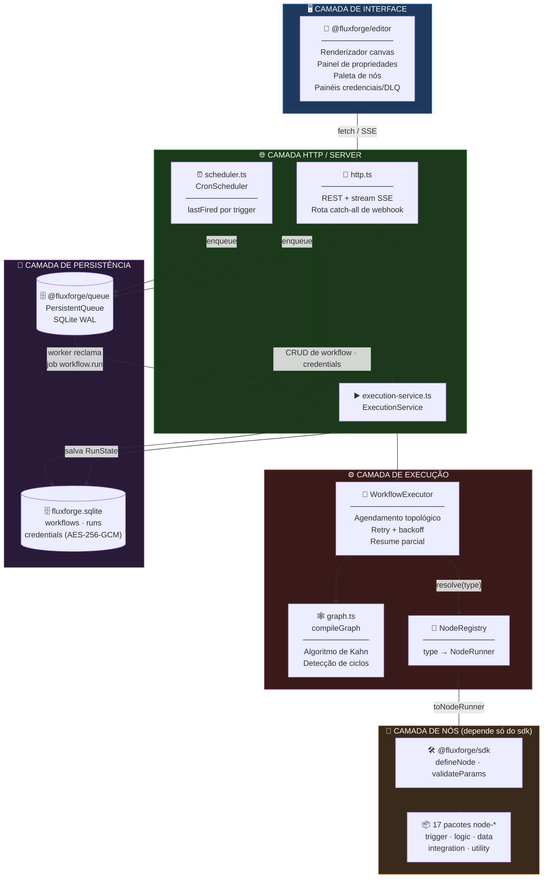
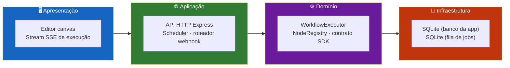
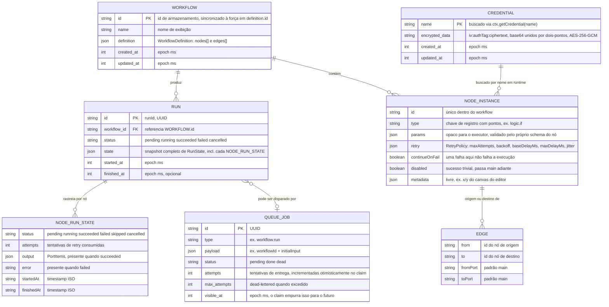
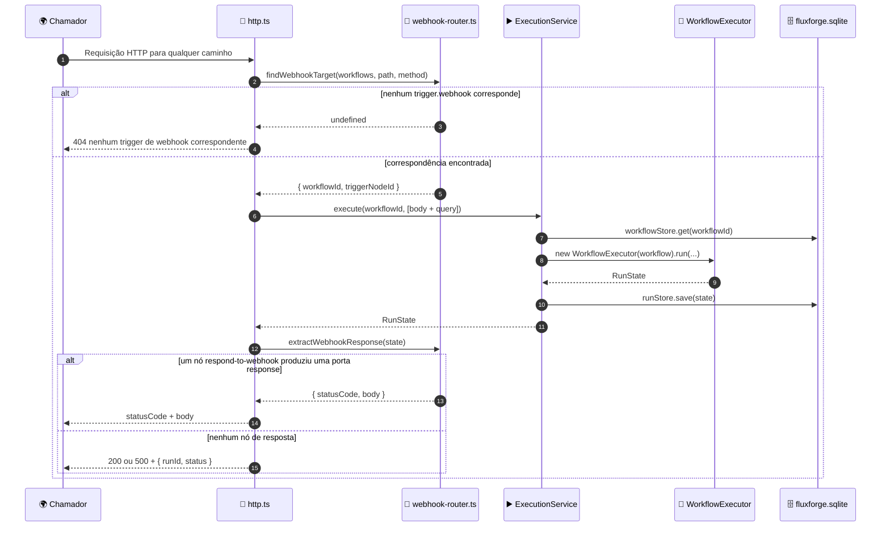
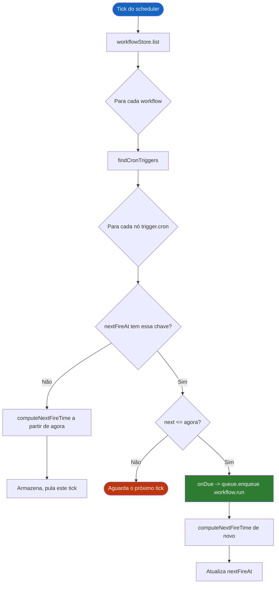
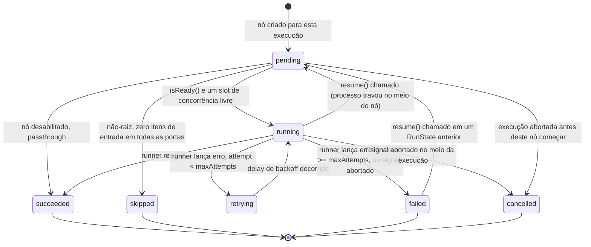
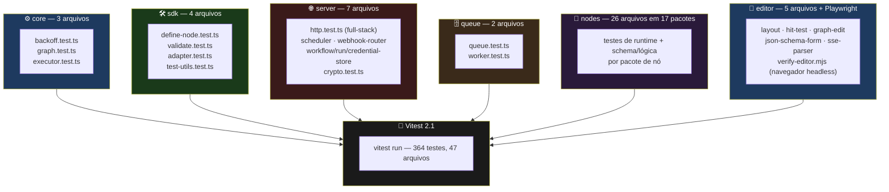

<div align="center">

**🌐 Choose Language / Selecione o Idioma / Elija el Idioma**

[](README.md)&nbsp;&nbsp;&nbsp;[](README_PT.md)&nbsp;&nbsp;&nbsp;[](README_ES.md)

</div>

---

<div align="center">

```
███████╗██╗     ██╗   ██╗██╗  ██╗███████╗ ██████╗ ██████╗  ██████╗ ███████╗
██╔════╝██║     ██║   ██║╚██╗██╔╝██╔════╝██╔═══██╗██╔══██╗██╔════╝ ██╔════╝
█████╗  ██║     ██║   ██║ ╚███╔╝ █████╗  ██║   ██║██████╔╝██║  ███╗█████╗
██╔══╝  ██║     ██║   ██║ ██╔██╗ ██╔══╝  ██║   ██║██╔══██╗██║   ██║██╔══╝
██║     ███████╗╚██████╔╝██╔╝ ██╗██║     ╚██████╔╝██║  ██║╚██████╔╝███████╗
╚═╝     ╚══════╝ ╚═════╝ ╚═╝  ╚═╝╚═╝      ╚═════╝ ╚═╝  ╚═╝ ╚═════╝ ╚══════╝
     Um motor de automação de fluxos de trabalho, escrito do zero em TypeScript
```

---

[](https://www.typescriptlang.org/)
[](https://nodejs.org/)
[](https://vitest.dev/)
[](https://www.sqlite.org/)
[](https://expressjs.com/)
[](https://vitejs.dev/)
[](https://zod.dev/)
[](LICENSE)

<br/>

> **Um motor de automação de fluxos de trabalho open-source, escrito do zero em TypeScript real.**
> Um executor de DAG com retry/backoff e re-execução parcial resistente a falhas, uma fila de jobs persistente em SQLite, um SDK de nós plugável, e um editor em canvas sem biblioteca de diagramação.

<br/>


</div>

---

## 📑 Índice

<details>
<summary>▶️ <strong>Clique para expandir / recolher esta seção</strong></summary>

<table>
<tr>
<td valign="top" width="50%">

**🏗️ Sistema**
- [Visão Geral](#-visão-geral)
- [Arquitetura do Sistema](#-arquitetura-do-sistema)
- [Stack Tecnológica](#-stack-tecnológica)
- [Padrões de Projeto](#-padrões-de-projeto-aplicados)
- [Estrutura do Projeto](#-estrutura-do-projeto)

**📦 Módulos**
- [Core — Executor de DAG](#-fluxforgecore--executor-de-dag)
- [SDK — Autoria de Nós](#-fluxforgesdk--autoria-de-nós)
- [Registry](#-fluxforgeregistry)
- [Queue — Fila Persistente](#-fluxforgequeue--fila-de-jobs-persistente)
- [Server](#-fluxforgeserver)
- [Editor](#-fluxforgeeditor)
- [Biblioteca de Nós (17 pacotes)](#-biblioteca-de-nós-17-pacotes)

</td>
<td valign="top" width="50%">

**💼 Negócio**
- [Regras de Negócio](#-regras-de-negócio)
- [Requisitos Funcionais](#-requisitos-funcionais)
- [Requisitos Não Funcionais](#-requisitos-não-funcionais)

**📐 Design**
- [Modelo de Dados](#-modelo-de-dados)
- [Fluxos do Sistema](#-fluxos-do-sistema)

**🔐 Segurança & Operação**
- [Segurança](#-segurança)
- [Instalação & Execução](#-instalação--execução)
- [Testes Automatizados](#-testes-automatizados)
- [Métricas & Monitoramento](#-métricas--monitoramento)
- [Limitações Conhecidas](#-limitações-conhecidas)

</td>
</tr>
</table>

---

</details>

## 🌟 Visão Geral

<details>
<summary>▶️ <strong>Clique para expandir / recolher esta seção</strong></summary>

**FluxForge** é um motor de automação de fluxos de trabalho open-source escrito do zero em TypeScript. n8n e Zapier são as referências para o que ele faz, não dependências: nada aqui é construído em cima de nenhum dos dois. Ele entrega um executor de grafo acíclico dirigido (DAG) com retry e backoff exponencial, re-execução parcial resistente a falhas, uma fila de jobs persistente em SQLite, um sistema de nós plugável com um SDK real para terceiros, e um editor visual em canvas construído sem biblioteca de diagramação.

O repositório é um monorepo de 23 pacotes em npm workspaces: `@fluxforge/core` (o executor), `@fluxforge/queue` (a fila de jobs), `@fluxforge/sdk` (o contrato de autoria de nós), `@fluxforge/registry` (busca de nós), `@fluxforge/server` (a API HTTP, o agendador e o roteador de webhooks), `@fluxforge/editor` (a interface no navegador), e 17 pacotes `@fluxforge/node-*` que fornecem nós de trigger, lógica, dados, integração e utilidade. Todo pacote que não é o editor nem o server depende apenas de `@fluxforge/core`, `@fluxforge/sdk` e `zod`, o que mantém a pegada de instalação de um autor de nó de terceiros em uma única dependência.

Um fluxo de trabalho é um DAG estrito: nós e arestas, sem ciclos. Um "loop" é comportamento interno de um nó, nunca uma forma de grafo, porque um grafo cíclico não tem uma ordem topológica bem definida para a lógica de retry e resume parcial raciocinar sobre. Essa única decisão (documentada como [ADR-0002](docs/adr/0002-dag-not-cyclic-graph.md) no código) molda quase tudo neste README: o algoritmo de agendamento do executor, a regra de pular ramos e a semântica de resume.

### 🎯 Objetivos do Sistema

| Objetivo | Descrição |
|-----------|-------------|
| ⚙️ **Execução determinística de DAG** | Ordena topologicamente e executa os nós de um fluxo com concorrência configurável, retentando nós com falha via backoff |
| 💾 **Resume parcial resistente a falhas** | Persiste um `RunState` após cada nó, para que uma execução travada ou cancelada continue de onde parou, sem reexecutar trabalho já concluído |
| 🔌 **Autoria de nós por terceiros** | Expõe `defineNode()` como o contrato inteiro que um novo pacote de integração precisa, com params validados por zod |
| 📥 **Enfileiramento persistente e recuperável de falhas** | Executa fluxos de forma assíncrona via uma fila de jobs SQLite usando um modelo de claim por visibility-timeout, sem processo separado de varredura |
| 🌐 **Automação disparada por HTTP** | Recebe webhooks e dispara agendamentos cron contra definições de fluxo armazenadas, com uma API REST para o resto |
| 🔐 **Armazenamento criptografado de credenciais** | Guarda tokens e segredos de terceiros criptografados em repouso com AES-256-GCM |
| 🎨 **Autoria visual** | Permite que uma pessoa construa, conecte, execute e inspecione um fluxo em um canvas com pan/zoom, sem biblioteca externa de diagramação |
| 🧪 **Correção verificada** | Cada pacote é coberto por testes unitários reais, mais um teste de integração HTTP full-stack e uma passagem end-to-end em navegador real |

---

</details>

## 🏗️ Arquitetura do Sistema

<details>
<summary>▶️ <strong>Clique para expandir / recolher esta seção</strong></summary>

### Diagrama de Módulos



### Camadas de Arquitetura



---

</details>

## 🛠️ Stack Tecnológica

<details>
<summary>▶️ <strong>Clique para expandir / recolher esta seção</strong></summary>

<table>
<thead>
<tr>
<th>Camada</th>
<th>Tecnologia</th>
<th>Versão</th>
<th>Propósito</th>
</tr>
</thead>
<tbody>
<tr>
<td rowspan="3"><strong>🧠 Linguagem</strong></td>
<td>TypeScript</td>
<td>^5.7.2</td>
<td>Modo strict, project references (<code>tsc -b</code>), <code>verbatimModuleSyntax</code></td>
</tr>
<tr>
<td>Node.js</td>
<td>&gt;=20 (engines)</td>
<td>Runtime do server, do worker da fila e do scheduler</td>
</tr>
<tr>
<td>ESM (<code>"type": "module"</code>)</td>
<td>—</td>
<td>Todo pacote do workspace, uniformemente</td>
</tr>
<tr>
<td rowspan="2"><strong>✅ Validação</strong></td>
<td>Zod</td>
<td>^4.4.3</td>
<td>Definições de <code>paramsSchema</code> dos nós, validadas em tempo de execução a cada chamada</td>
</tr>
<tr>
<td>JSON Schema (2020-12)</td>
<td>via <code>z.toJSONSchema</code></td>
<td>Serializado para o editor via <code>GET /api/nodes</code>, formulários guiados pelo schema</td>
</tr>
<tr>
<td rowspan="2"><strong>💾 Persistência</strong></td>
<td>better-sqlite3</td>
<td>^13.0.3</td>
<td>Driver SQLite síncrono, modo journal WAL, usado pelo banco da app e pelo banco da fila</td>
</tr>
<tr>
<td>node:crypto</td>
<td>nativo</td>
<td>Criptografia AES-256-GCM de credenciais, geração de UUID</td>
</tr>
<tr>
<td rowspan="2"><strong>🌐 Server</strong></td>
<td>Express</td>
<td>^4.21.2</td>
<td>API REST, stream SSE de execução, rota catch-all de webhook</td>
</tr>
<tr>
<td>tsx</td>
<td>^4.23.9</td>
<td>Modo watch sem build para <code>npm run dev:server</code></td>
</tr>
<tr>
<td rowspan="2"><strong>🎨 Editor</strong></td>
<td>Vite</td>
<td>^6.0.7</td>
<td>Servidor dev (porta 5180, proxy de <code>/api</code>) e build de produção</td>
</tr>
<tr>
<td>Canvas 2D API</td>
<td>nativo do navegador</td>
<td>Renderização do grafo de nós — sem dependência de biblioteca de diagramação</td>
</tr>
<tr>
<td rowspan="2"><strong>🔧 Build & Qualidade</strong></td>
<td>TypeScript project references</td>
<td><code>tsc -b tsconfig.json</code></td>
<td>Builds compostos e incrementais nos 23 workspaces</td>
</tr>
<tr>
<td>ESLint + typescript-eslint</td>
<td>^9.17 / ^8.19</td>
<td><code>eqeqeq</code>, sem <code>var</code>, imports de tipo consistentes, sem variáveis não usadas</td>
</tr>
<tr>
<td rowspan="2"><strong>🧪 Testes</strong></td>
<td>Vitest</td>
<td>^2.1.8</td>
<td>364 testes em 47 arquivos, com aliases de caminho por pacote do workspace</td>
</tr>
<tr>
<td>Playwright</td>
<td>^1.62.1</td>
<td>Passagem end-to-end em navegador headless, dirigindo a interface real do editor</td>
</tr>
</tbody>
</table>

---

</details>

## 🎨 Padrões de Projeto Aplicados

<details>
<summary>▶️ <strong>Clique para expandir / recolher esta seção</strong></summary>

| Padrão | Onde | Justificativa |
|---------|-------|-----------|
| 🏭 **Factory function** | `defineNode()` em `packages/sdk/src/define-node.ts` | Valida e congela uma `NodeDefinition` no momento da autoria, para que um nó malformado falhe na suíte de testes do próprio autor, não no meio de uma execução |
| 🔌 **Adapter** | `toNodeRunner()` em `packages/sdk/src/adapter.ts` | Faz a ponte entre a `NodeDefinition` tipada do SDK e a função `NodeRunner` não tipada do core — o único lugar onde as duas formas se encontram |
| 📇 **Registry** | `NodeRegistry` em `packages/registry/src/registry.ts` | Coleta definições de nós nativos e de terceiros e as expõe como um `NodeRunnerResolver`, sem opinião sobre quais nós existem |
| 🔁 **Strategy** | `NodeRunnerResolver.resolve(type)` em `packages/core/src/types.ts` | O executor recebe uma interface de resolver; nunca sabe se um type mapeia para um runner nativo ou de terceiros |
| 📡 **Observer / pub-sub** | `RunEventBus` em `packages/core/src/events.ts` | Um conjunto mínimo e tipado de listeners por execução, conectado 1:1 a Server-Sent Events por `http.ts` |
| ⏳ **Claim por visibility-timeout** | `PersistentQueue.claim()` em `packages/queue/src/queue.ts` | A recuperação de falhas surge do próprio modelo de claim (`visible_at` expirado), sem processo separado de heartbeat |
| 🧱 **Objetos de comando imutáveis** | `graph-edit.ts` em `packages/editor/src/graph-edit.ts` | Toda edição retorna um novo `WorkflowDefinition` em vez de mutar um existente, tornando undo/redo trivial |
| 🚦 **Guard clause / fail-fast** | `compileGraph()` em `packages/core/src/graph.ts`, `getEncryptionKey()` em `packages/server/src/crypto.ts` | Ids de nó duplicados, arestas soltas, ciclos e uma chave de criptografia ausente lançam erro imediatamente, em vez de degradar silenciosamente |
| 🧩 **Injeção de dependência** | `ExecutorOptions` (`now`, `random`, `sleep`) em `packages/core/src/executor.ts` | Relógio, gerador aleatório e sleep são injetáveis, o que torna os testes de tempo de retry exatos em vez de "eventualmente, provavelmente" |

---

</details>

## 📁 Estrutura do Projeto

<details>
<summary>▶️ <strong>Clique para expandir / recolher esta seção</strong></summary>

```
fluxforge/
│
├── 📄 package.json                    # Manifesto raiz dos workspaces, scripts npm (build/test/lint/check)
├── 📄 tsconfig.json                   # Raiz de project references — uma entrada por pacote do workspace
├── 📄 tsconfig.base.json              # Opções de compilador strict compartilhadas (ES2022, verbatimModuleSyntax)
├── 📄 vitest.config.ts                # Aliases de caminho por workspace + aliases node-* auto-descobertos
├── 📄 eslint.config.js                # Config flat do typescript-eslint (eqeqeq, no-var, ...)
│
├── 📂 docs/
│   └── 📂 adr/                        # Architecture Decision Records (ADR-0002..0005 referenciados abaixo)
│
├── 📂 examples/
│   ├── 📄 README.md                   # Como carregar os dois fluxos de exemplo
│   ├── 📄 webhook-echo.json           # trigger.webhook -> respond-to-webhook, ida e volta
│   └── 📄 scheduled-slack-digest.json # trigger.cron -> rss-read -> slack-webhook em cadeia
│
├── 📂 scripts/
│   ├── 📄 scaffold-node.mjs           # `npm run scaffold:node` — gera um novo pacote de nó
│   └── 📄 verify-editor.mjs           # Driver Playwright end-to-end para o editor
│
├── 📂 packages/
│   ├── 📂 core/                       # @fluxforge/core — tipos de DAG, compilador de grafo, executor, backoff
│   │   └── 📂 src/
│   │       ├── 📄 types.ts            # WorkflowDefinition, NodeInstance, RunState, RunEvent, ...
│   │       ├── 📄 graph.ts            # compileGraph — algoritmo de Kahn + detecção de ciclos
│   │       ├── 📄 executor.ts         # WorkflowExecutor — run() / resume()
│   │       ├── 📄 backoff.ts          # calculateBackoffDelay — fixo/exponencial + jitter
│   │       └── 📄 events.ts           # RunEventBus — pub/sub tipado por execução
│   │
│   ├── 📂 sdk/                        # @fluxforge/sdk — defineNode() e todo o contrato de autoria
│   ├── 📂 registry/                   # @fluxforge/registry — NodeRegistry, fábrica de NodeRunnerResolver
│   ├── 📂 queue/                      # @fluxforge/queue — PersistentQueue (SQLite), QueueWorker
│   ├── 📂 server/                     # @fluxforge/server — API HTTP, scheduler, credenciais, webhooks
│   │   └── 📂 src/
│   │       ├── 📄 http.ts             # App Express: REST + SSE + catch-all de webhook
│   │       ├── 📄 main.ts             # Bootstrap real — conecta db, fila, scheduler, registry, http
│   │       ├── 📄 scheduler.ts        # CronScheduler — polling com lastFired por trigger
│   │       ├── 📄 crypto.ts           # encrypt/decrypt AES-256-GCM
│   │       ├── 📄 credential-store.ts # CRUD de credenciais criptografadas em repouso
│   │       ├── 📄 webhook-router.ts   # findWebhookTarget / extractWebhookResponse
│   │       ├── 📄 workflow-store.ts   # CRUD de workflows sobre SQLite
│   │       ├── 📄 run-store.ts        # Persistência de RunState
│   │       ├── 📄 execution-service.ts# Une registry + stores em execute()/resume()
│   │       ├── 📄 builtins.ts         # O único arquivo que importa todos os pacotes node-*
│   │       └── 📄 db.ts               # openDb — schema de workflows/runs/credentials
│   │
│   ├── 📂 editor/                     # @fluxforge/editor — o editor visual baseado em canvas
│   │   └── 📂 src/
│   │       ├── 📄 app.ts              # EditorApp — controller que conecta DOM/canvas ao graph-edit
│   │       ├── 📄 canvas.ts           # render() de pixels — lê a geometria pura de layout.ts
│   │       ├── 📄 layout.ts           # Geometria pura de nós/portas/arestas, testável isoladamente
│   │       ├── 📄 hit-test.ts         # Testes de acerto puros para portas/arestas/corpos de nó
│   │       ├── 📄 graph-edit.ts       # Edições puras e imutáveis de WorkflowDefinition
│   │       ├── 📄 api-client.ts       # Wrapper fetch tipado sobre a superfície REST + SSE do server
│   │       ├── 📄 json-schema-form.ts # JSON Schema -> descritores de campo de formulário
│   │       ├── 📄 property-panel.ts   # Formulário de propriedades de nó guiado por schema
│   │       ├── 📄 node-palette.ts     # Lista lateral de tipos de nó registrados por categoria
│   │       ├── 📄 credentials-panel.ts# Modal sobre /api/credentials
│   │       ├── 📄 dead-letter-panel.ts# Modal sobre /api/dead-letter + requeue
│   │       └── 📄 sse-parser.ts       # Parser puro de chunks SSE (corpo de fetch, não EventSource)
│   │
│   └── 📂 nodes/                      # 17 pacotes @fluxforge/node-*, cada um: package.json, src/schema.ts, src/runtime.ts
│       ├── 📂 manual/  📂 cron/  📂 webhook/            # categoria trigger
│       ├── 📂 if/  📂 switch/  📂 filter/               # categoria logic
│       ├── 📂 set/  📂 aggregate/  📂 code/             # categoria data
│       ├── 📂 http-request/                             # categoria action
│       ├── 📂 slack-webhook/  📂 discord-webhook/
│       │   📂 github-issue/  📂 rss-read/
│       │   📂 google-sheets-append/                     # categoria integration
│       └── 📂 no-op/  📂 respond-to-webhook/             # categoria utility
│
├── 📄 README.md                       # 🇺🇸 English (primário)
├── 📄 README_PT.md                    # 🇧🇷 Português
└── 📄 README_ES.md                    # 🇪🇸 Español
```

---

</details>

## 📦 Módulos do Sistema

<details>
<summary>▶️ <strong>Clique para expandir / recolher esta seção</strong></summary>

### ⚙️ `@fluxforge/core` — Executor de DAG

Os tipos de DAG, a compilação de grafo, o executor, retry/backoff, e o resume de execução parcial. Não depende de nenhum outro pacote do monorepo.

| Responsabilidade | Implementação |
|-----------------|-----------------|
| Validação e indexação de grafo | `compileGraph()` — ids de nó duplicados, arestas soltas e ciclos lançam `GraphValidationError` |
| Ordenação topológica | `topologicalSort()` — algoritmo de Kahn; uma fila restante não vazia é um certificado direto de ciclo |
| Agendamento | `WorkflowExecutor.execute()` — executa nós prontos até `concurrency` (padrão 4) simultaneamente via `Promise.race` |
| Cascata de pular ramos | Um nó não-raiz com zero itens de entrada coletados em todas as portas é marcado `skipped`, não executado — sem lógica especial de nó de ramo em lugar nenhum |
| Retry com backoff | `calculateBackoffDelay(attempt, policy, random)` — fixo ou exponencial, limitado por `maxDelayMs` antes do jitter ser aplicado |
| Resume parcial | `WorkflowExecutor.resume(previous)` — nós `succeeded`/`skipped` são reaproveitados como estão; nós `running`/`failed` voltam a `pending`, tentativa 1 |
| Emissão de eventos | `RunEventBus` — `run.started/succeeded/failed/cancelled`, `node.started/succeeded/retrying/failed/skipped` |

---

### 🛠️ `@fluxforge/sdk` — Autoria de Nós

O contrato inteiro de autoria de nós de terceiros: `defineNode()`, params validados por zod, um adaptador de `NodeDefinition` para `NodeRunner`, e utilitários de teste. Depende apenas de `@fluxforge/core` e `zod`.

| Responsabilidade | Implementação |
|-----------------|-----------------|
| Validação de definição | `defineNode()` — exige `type` em minúsculas separado por pontos (`TYPE_PATTERN`), `displayName`/`description` não vazios, ids de porta únicos |
| Validação de params | `validateParams()` — analisa params brutos contra `paramsSchema` a cada execução (não a cada save), pois um param pode ser resolvido diferente entre execuções |
| Ponte com o core | `toNodeRunner(def, credentials)` — o único lugar onde uma `NodeDefinition` vira um `NodeRunner` que o core pode chamar |
| Busca de credenciais | `CredentialResolver.getCredential(name)` — injetado por resolver; usa um resolver no-op por padrão |
| Utilitários de teste | `createTestContext()`, `runNode()` — constroem um `NodeContext` e executam um nó exatamente como o executor real faz, sem importar o executor |

---

### 📇 `@fluxforge/registry`

Coleta `NodeDefinition`s (nativas ou de terceiros) e as expõe como um `NodeRunnerResolver` para o executor e uma listagem para a paleta do editor. Depende de core e sdk.

| Método | Comportamento |
|--------|----------|
| `register(def)` | Lança `DuplicateNodeTypeError` se `def.type` já estiver registrado |
| `registerAll(defs)` | Conveniência usada por `builtins.ts` para registrar os 17 nós nativos de uma vez |
| `list()` | Toda definição registrada — o que alimenta `GET /api/nodes` e a paleta do editor |
| `createResolver(credentials?)` | Retorna um `NodeRunnerResolver` vinculado a um resolver de credenciais, cacheando resultados de `toNodeRunner` por type |

---

### 🗄️ `@fluxforge/queue` — Fila de Jobs Persistente

Uma fila de jobs persistente sobre SQLite (`better-sqlite3`): claims por visibility-timeout, retries agendados com backoff, dead-lettering, e um pequeno worker de poll-loop.

| Método | Comportamento |
|--------|----------|
| `enqueue(type, payload, options)` | Insere um job `pending`; `visible_at` padrão é agora mais `delayMs` |
| `claim(visibilityTimeoutMs, type?)` | Roda dentro de `BEGIN IMMEDIATE` (não deferida) para que dois processos compartilhando um arquivo nunca reivindiquem o mesmo job em duplicidade; dead-lettera automaticamente um job cuja próxima tentativa excederia `maxAttempts` |
| `complete(jobId)` | Marca um job reivindicado como `done` |
| `fail(jobId, error, policy?)` | Reagenda com `calculateBackoffDelay` se restarem tentativas, senão marca `dead` |
| `release(jobId)` | Desfaz o incremento otimista de tentativa para um desligamento gracioso do worker, distinto de uma falha real |
| `deadLetter()` / `requeue(jobId)` | Lista e reinicia jobs dead-lettered de volta a um ciclo de tentativas `pending` novo |
| `QueueWorker` | Um loop `claim → handler → complete/fail`; `stop()` deixa o job em andamento terminar em vez de abortá-lo |

---

### 🌐 `@fluxforge/server`

O servidor HTTP que amarra tudo: CRUD de workflows, execução direta e em fila, recebimento de webhooks, agendamento cron, e armazenamento de credenciais criptografado em repouso.

| Componente | Arquivo | Responsabilidade |
|-----------|------|-----------------|
| Banco de dados | `db.ts` | Um arquivo SQLite (tabelas `workflows`, `runs`, `credentials`), separado do arquivo de banco da fila |
| Workflow store | `workflow-store.ts` | `save()` força `definition.id` a bater com o id de armazenamento, para que `RunState.workflowId` nunca divirja da chave de busca |
| Run store | `run-store.ts` | Persiste todo `RunState`, o que faz o histórico de execuções sobreviver a um restart e torna `resume()` localizável |
| Credential store | `credential-store.ts` + `crypto.ts` | AES-256-GCM (`node:crypto`), chave vinda de `FLUXFORGE_CREDENTIALS_KEY` (32 bytes, base64) |
| Execution service | `execution-service.ts` | Constrói um `WorkflowExecutor` por chamada, aguarda a execução, persiste o resultado |
| Webhook router | `webhook-router.ts` | `findWebhookTarget()` varre linearmente os workflows armazenados buscando um nó `trigger.webhook` correspondente; `extractWebhookResponse()` lê a primeira porta `response` em uma execução concluída |
| Scheduler | `scheduler.ts` | `CronScheduler` faz polling em cada nó `trigger.cron`, rastreando um `lastFired` por trigger para que um workflow recém-adicionado não dispare para o tempo "perdido" |
| App HTTP | `http.ts` | App Express: `/api/nodes`, `/api/workflows*`, `/api/runs/:id`, `/api/credentials*`, `/api/dead-letter*`, mais uma rota catch-all de webhook |
| Bootstrap | `main.ts` | O único arquivo que conecta db, stores, registry, worker da fila, scheduler e app HTTP |

---

### 🎨 `@fluxforge/editor`

O editor visual de workflows baseado em navegador: um grafo de nós em canvas, um painel de propriedades guiado por schema, e status de execução ao vivo. Depende apenas de core e sdk (para tipos).

| Componente | Arquivo | Responsabilidade |
|-----------|------|-----------------|
| Controller | `app.ts` | `EditorApp` — mantém o estado mutável do editor, conecta eventos de DOM/canvas às funções puras de `graph-edit.ts` |
| Renderizador | `canvas.ts` | Renderização de pixels deliberadamente não testada; tudo que ele desenha (posições, acertos) é decidido em outro lugar |
| Geometria | `layout.ts` | Geometria pura de nós/portas/arestas: `computeNodeLayout`, `bezierControlOffset`, `resolveEdgeEndpoints` |
| Teste de acerto | `hit-test.ts` | Testes de acerto puros para portas/arestas/corpos de nó, tolerância dividida pelo zoom atual |
| Edições de grafo | `graph-edit.ts` | Transformações puras e imutáveis de `WorkflowDefinition` — `addNode`, `removeEdge`, `updateNodeParams`, ... |
| Cliente de API | `api-client.ts` | Wrapper `fetch` tipado para a superfície REST mais streaming de execução via SSE |
| Formulários de schema | `json-schema-form.ts` | Lê o JSON Schema de um nó (draft 2020-12, como emitido por `z.toJSONSchema`) em descritores de campo de formulário |
| Painel de propriedades | `property-panel.ts` | Reconstrói um formulário do zero a cada `show()` a partir do schema do nó selecionado |
| Paleta de nós | `node-palette.ts` | Lista lateral de tipos de nó registrados, agrupados por categoria |
| Painel de credenciais | `credentials-panel.ts` | Modal sobre `/api/credentials`; mostra só nomes, valores nunca saem do servidor |
| Painel de dead-letter | `dead-letter-panel.ts` | Modal listando `PersistentQueue.deadLetter()` com uma ação de requeue |
| Parser SSE | `sse-parser.ts` | `parseSseChunk()` puro para SSE via corpo de `fetch()`, já que `EventSource` não pode fazer o `POST` que iniciar uma execução exige |

---

### 🧩 Biblioteca de Nós (17 pacotes)

Todo pacote de nó não depende de nada além de `@fluxforge/sdk` (e `zod`, transitivamente). Cada um exporta um resultado de `defineNode()` a partir de `src/runtime.ts`, validado por `src/schema.ts`.

| Type | Categoria | Pacote | Comportamento |
|------|----------|---------|----------|
| `trigger.manual` | trigger | `node-manual` | Passa o `initialInput` semeado da execução direto adiante — o trigger padrão de todo workflow novo |
| `trigger.cron` | trigger | `node-cron` | Emite `{ firedAt }` quando invocado; o `CronScheduler` decide *quando* via `nextFireTime(expression, after)` (cron de 5 campos, só UTC) |
| `trigger.webhook` | trigger | `node-webhook` | Apenas declarativo — params `path`/`method` que `findWebhookTarget` compara contra requisições recebidas; `run()` passthrough |
| `logic.if` | logic | `node-if` | Divide itens individualmente entre as portas `true`/`false` por uma condição de campo/operador/valor |
| `logic.switch` | logic | `node-switch` | Roteia cada item para uma de cinco portas fixas `case-0`..`case-4` (igualdade estrita) ou `default` |
| `logic.filter` | logic | `node-filter` | Mantém só os itens correspondentes em uma única porta `main`, descartando o resto |
| `data.set` | data | `node-set` | Remove campos, depois aplica as sobrescritas de `set` — `remove` antes de `set`, para que um campo reatribuído nunca seja re-removido |
| `data.aggregate` | data | `node-aggregate` | Reduz itens a um item de resumo (ou um por valor de `groupBy`): sum/count/avg/min/max sobre um campo numérico |
| `data.code` | data | `node-code` | Avalia uma expressão JS por item via `new Function` — sem sandbox, com privilégios completos do processo, só para workflows autoescritos |
| `action.http-request` | action | `node-http-request` | Faz fetch por item (ou uma vez) com timeout (`AbortController`, padrão 10s), credencial bearer opcional, alternância `ignoreHttpErrors` |
| `integration.slack-webhook` | integration | `node-slack-webhook` | Posta `text`/`channel`/`username` em uma URL de Incoming Webhook do Slack |
| `integration.discord-webhook` | integration | `node-discord-webhook` | Posta `content`/`username` em uma URL de webhook do Discord |
| `integration.github-issue` | integration | `node-github-issue` | Cria uma issue no GitHub via API REST; requer uma credencial `github` com um campo `token` |
| `integration.rss-read` | integration | `node-rss-read` | Busca e analisa um feed RSS/Atom em itens `title`/`link`/`publishedAt` (nó raiz, sem entradas) |
| `integration.google-sheets-append` | integration | `node-google-sheets-append` | Adiciona uma linha via Sheets API v4 `values.append`; requer uma credencial `google` com um `token` OAuth2 |
| `utility.no-op` | utility | `node-no-op` | Passa `main` adiante sem alterações — um placeholder para um workflow ainda em construção |
| `utility.respond-to-webhook` | utility | `node-respond-to-webhook` | Declara o status/corpo HTTP com que uma execução disparada por webhook deve responder; lido por `webhook-router.ts`, nunca conectado a jusante |

---

</details>

## 💼 Regras de Negócio

<details>
<summary>▶️ <strong>Clique para expandir / recolher esta seção</strong></summary>

### 🕸️ Regras da Forma do Grafo

| # | Regra | Aplicação |
|---|------|-------------|
| RN-01 | Os ids de nó de um workflow devem ser únicos | `compileGraph()` lança `GraphValidationError` em duplicata |
| RN-02 | Toda aresta deve referenciar ids de nó existentes nas duas pontas | `compileGraph()` lança erro em `from`/`to` solto |
| RN-03 | Um grafo de workflow não pode conter ciclos | A checagem de fila restante de `topologicalSort()` lança erro, nomeando os nós presos |
| RN-04 | Um "loop" é comportamento de runtime do próprio nó, nunca uma forma de grafo | Nenhuma construção de grafo cíclico existe em `@fluxforge/core` (ADR-0002) |

### ▶️ Regras de Execução

| # | Regra | Aplicação |
|---|------|-------------|
| RN-05 | Um nó só se torna elegível quando todo predecessor alcança um status terminal | `isReady()` em `executor.ts` |
| RN-06 | Um nó não-raiz com zero itens de entrada coletados em todas as portas é pulado, não executado | A regra genérica de pular por entrada vazia, sem caso especial para nó de ramo |
| RN-07 | Um predecessor `failed` ou `skipped` não contribui com nenhum item a jusante | `gatherInput()` só lê de fontes `succeeded` |
| RN-08 | Um nó cujo type não tem runner registrado falha a execução (a menos que `continueOnFail`) | Ramo de resolver ausente em `runOneNode()` |
| RN-09 | Um nó desabilitado é bem-sucedido trivialmente, passando sua entrada `main` adiante | Ramo `if (node.disabled)` em `runOneNode()` |
| RN-10 | Retries consomem o orçamento de `maxAttempts` do próprio nó; um crash de processo no meio de um nó não | `resume()` reseta nós `running` para `pending`, tentativa 1 |

### 🗄️ Regras da Fila

| # | Regra | Aplicação |
|---|------|-------------|
| RN-11 | O `attempts` de um job conta tentativas de entrega, não execuções concluídas | Incrementado otimisticamente dentro de `claim()`, antes do handler rodar |
| RN-12 | Um job cuja próxima entrega excederia `maxAttempts` é dead-lettered pelo próprio caminho de claim | Ramo `nextAttempts > row.max_attempts` de `claim()`, sem varredura separada |
| RN-13 | Dois processos compartilhando um arquivo SQLite nunca devem reivindicar o mesmo job em duplicidade | `claim()` roda dentro de `BEGIN IMMEDIATE`, não uma transação deferida |
| RN-14 | Um desligamento gracioso do worker não deve contar como falha de entrega | `release()` decrementa o incremento otimista de `attempts` |

### 🔐 Regras de Credenciais & Server

| # | Regra | Aplicação |
|---|------|-------------|
| RN-15 | O `definition.id` de um workflow armazenado deve sempre igualar seu id de armazenamento | `WorkflowStore.save()` força a sobrescrita de `definition.id` |
| RN-16 | Valores de credenciais nunca são retornados pelo endpoint de listagem | `GET /api/credentials` retorna `credentialStore.list()` (só nomes) |
| RN-17 | O servidor deve recusar iniciar sem uma chave de criptografia válida de 32 bytes | `getEncryptionKey()` lança `MissingEncryptionKeyError` |

---

</details>

## ✅ Requisitos Funcionais

<details>
<summary>▶️ <strong>Clique para expandir / recolher esta seção</strong></summary>

| ID | Requisito | Prioridade | Status |
|----|-------------|----------|--------|
| **RF-01** | O sistema deve compilar uma definição de workflow em um grafo indexado e validado | 🔴 Alta | ✅ Implementado |
| **RF-02** | O sistema deve detectar e rejeitar grafos de workflow cíclicos | 🔴 Alta | ✅ Implementado |
| **RF-03** | O sistema deve executar nós prontos concorrentemente até um limite configurável | 🔴 Alta | ✅ Implementado |
| **RF-04** | O sistema deve retentar um nó com falha usando backoff fixo ou exponencial com jitter | 🔴 Alta | ✅ Implementado |
| **RF-05** | O sistema deve pular um nó não-raiz que recebe zero itens de entrada | 🔴 Alta | ✅ Implementado |
| **RF-06** | O sistema deve persistir um `RunState` após a execução terminar | 🔴 Alta | ✅ Implementado |
| **RF-07** | O sistema deve retomar uma execução anterior sem reexecutar nós já bem-sucedidos | 🔴 Alta | ✅ Implementado |
| **RF-08** | O sistema deve permitir que um pacote de terceiros defina um nó via `defineNode()` | 🔴 Alta | ✅ Implementado |
| **RF-09** | O sistema deve validar os params de um nó contra seu próprio schema zod a cada execução | 🔴 Alta | ✅ Implementado |
| **RF-10** | O sistema deve expor todo tipo de nó registrado via `GET /api/nodes` com um JSON Schema | 🟡 Média | ✅ Implementado |
| **RF-11** | O sistema deve persistir jobs em uma fila durável baseada em SQLite | 🔴 Alta | ✅ Implementado |
| **RF-12** | O sistema deve reclamar o job de um worker travado assim que seu visibility timeout expirar | 🔴 Alta | ✅ Implementado |
| **RF-13** | O sistema deve dead-letterar um job que esgota seu orçamento de retry e permitir reenfileirá-lo | 🟡 Média | ✅ Implementado |
| **RF-14** | O sistema deve aceitar CRUD de workflows via API REST | 🔴 Alta | ✅ Implementado |
| **RF-15** | O sistema deve transmitir eventos de execução ao vivo via Server-Sent Events | 🟡 Média | ✅ Implementado |
| **RF-16** | O sistema deve rotear uma requisição HTTP recebida para um nó `trigger.webhook` correspondente | 🔴 Alta | ✅ Implementado |
| **RF-17** | O sistema deve responder a uma execução disparada por webhook usando a saída de um nó `respond-to-webhook` | 🟡 Média | ✅ Implementado |
| **RF-18** | O sistema deve disparar nós `trigger.cron` de acordo com uma expressão cron de 5 campos | 🔴 Alta | ✅ Implementado |
| **RF-19** | O sistema deve armazenar credenciais criptografadas em repouso com AES-256-GCM | 🔴 Alta | ✅ Implementado |
| **RF-20** | O sistema nunca deve retornar o valor de uma credencial pelo endpoint de listagem | 🔴 Alta | ✅ Implementado |
| **RF-21** | O sistema deve permitir que um usuário construa e edite visualmente um workflow em um canvas com pan/zoom | 🔴 Alta | ✅ Implementado |
| **RF-22** | O sistema deve renderizar um formulário de propriedades guiado por schema para o nó selecionado | 🟡 Média | ✅ Implementado |
| **RF-23** | O sistema deve permitir que um usuário execute um workflow pelo editor e veja o status ao vivo dos nós | 🟡 Média | ✅ Implementado |
| **RF-24** | O sistema deve permitir que um usuário gerencie credenciais e jobs dead-lettered pela UI do editor | 🟢 Baixa | ✅ Implementado |
| **RF-25** | O sistema deve gerar o esqueleto de um novo pacote de nó via um comando de CLI | 🟢 Baixa | ✅ Implementado |

---

</details>

## ⚡ Requisitos Não Funcionais

<details>
<summary>▶️ <strong>Clique para expandir / recolher esta seção</strong></summary>

| ID | Categoria | Requisito | Alvo |
|----|----------|-------------|--------|
| **RNF-01** | ⚡ Performance | Caminho quente de busca de nós do executor | Buscas O(1) em `Map`, indexadas uma vez por execução por `compileGraph()` |
| **RNF-02** | ⚡ Performance | Concorrência padrão de execução | 4 nós simultâneos (`ExecutorOptions.concurrency`) |
| **RNF-03** | 🔐 Segurança | Criptografia de credenciais | AES-256-GCM, chave de 32 bytes vinda de `FLUXFORGE_CREDENTIALS_KEY` |
| **RNF-04** | 🔐 Segurança | Inicialização do servidor sem chave de criptografia | Deve falhar rápido (`MissingEncryptionKeyError`), nunca iniciar sem criptografia |
| **RNF-05** | 🧱 Confiabilidade | Segurança de claim entre processos na fila | Transação `BEGIN IMMEDIATE`, nunca uma deferida |
| **RNF-06** | 🧱 Confiabilidade | Recuperação de falhas | Decorre do modelo de visibility-timeout; sem processo de varredura separado |
| **RNF-07** | 🧪 Testabilidade | Determinismo de tempo do executor | `now`, `random`, `sleep` todos injetáveis em `ExecutorOptions` |
| **RNF-08** | 🧪 Testabilidade | Tamanho e taxa de sucesso da suíte de testes | 364 testes, 47 arquivos, 100% passando no momento da escrita |
| **RNF-09** | 🧩 Extensibilidade | Pegada de dependências de nó de terceiros | Apenas `@fluxforge/sdk` + `zod`, nunca core/queue/server/editor |
| **RNF-10** | 🧩 Extensibilidade | Tempo para gerar um novo nó | Um comando de CLI (`npm run scaffold:node`) gera todo o layout de arquivos |
| **RNF-11** | 🔧 Manutenibilidade | Sistema de build | Project references `tsc -b` nos 23 pacotes compostos |
| **RNF-12** | 🔧 Manutenibilidade | Disciplina de lint | `eqeqeq`, sem `var`, sem variáveis não usadas, imports de tipo consistentes aplicados |
| **RNF-13** | 📦 Portabilidade | Dependência de runtime | Node.js >=20, sem passo de build nativo além do binário pré-compilado do `better-sqlite3` |
| **RNF-14** | 🌐 Compatibilidade | Requisito de navegador do editor | Qualquer navegador com Canvas 2D e `fetch`; sem funcionalidade de runtime específica de bundler |
| **RNF-15** | 📈 Escalabilidade (declarado, honesto) | Correspondência de rotas de webhook | Varredura linear sobre os nós dos workflows armazenados — explicitamente aceitável em escala self-hosted, não indexado |
| **RNF-16** | ♿ Usabilidade | Segurança da UI de credenciais | Valores nunca renderizados ou transmitidos de volta ao navegador após serem definidos |

---

</details>

## 🗄️ Modelo de Dados

<details>
<summary>▶️ <strong>Clique para expandir / recolher esta seção</strong></summary>

FluxForge persiste em dois arquivos SQLite separados (`db.ts` para a aplicação, `queue.ts` para os jobs), deliberadamente mantidos apartados já que o pacote de fila não sabe o que é um "workflow".

### Diagrama Entidade-Relacionamento



### Schema do Banco de Aplicação (`fluxforge.sqlite`)

| Tabela | Colunas-chave | Notas |
|-------|-------------|-------|
| `workflows` | `id` (PK), `name`, `definition` (texto JSON), `created_at`, `updated_at` | `definition.id` é sempre sincronizado à força com `id` ao salvar |
| `runs` | `id` (PK), `workflow_id`, `status`, `state` (texto JSON), `started_at`, `finished_at` | Indexado por `(workflow_id, started_at DESC)` para `listForWorkflow` |
| `credentials` | `name` (PK), `encrypted_data`, `created_at`, `updated_at` | `encrypted_data` nunca é descriptografado fora de `CredentialStore.getCredential` |

### Schema do Banco da Fila (`fluxforge-queue.sqlite`)

| Coluna | Tipo | Notas |
|--------|------|-------|
| `id`, `type`, `payload` | TEXT | `payload` é texto JSON |
| `status` | TEXT | `pending` \| `done` \| `dead` |
| `attempts`, `max_attempts` | INTEGER | Um contador de entrega, não um contador de execuções concluídas |
| `backoff_kind`, `base_delay_ms`, `max_delay_ms` | TEXT / INTEGER | Alimenta `calculateBackoffDelay` em `fail()` |
| `visible_at` | INTEGER | Indexado com `status` para a consulta de `claim()` |

---

</details>

## 🔄 Fluxos do Sistema

<details>
<summary>▶️ <strong>Clique para expandir / recolher esta seção</strong></summary>

### Fluxo de Execução Disparado por Webhook



### Fluxo de Agendamento Cron



### Máquina de Estados de Execução e Retry de Nó



---

</details>

## 🔐 Segurança

<details>
<summary>▶️ <strong>Clique para expandir / recolher esta seção</strong></summary>

### Controles Implementados

| Controle | Implementação | Efeito |
|---------|-----------------|--------|
| 🔐 **Criptografia de credenciais em repouso** | AES-256-GCM via `node:crypto` em `crypto.ts`, chave vinda de `FLUXFORGE_CREDENTIALS_KEY` | Um arquivo SQLite roubado não pode ser lido sem a chave de 32 bytes |
| 🚫 **Fail-fast em chave ausente** | `getEncryptionKey()` lança `MissingEncryptionKeyError` se a variável de ambiente estiver ausente ou malformada | O servidor nunca inicia silenciosamente sem criptografia |
| 🔏 **Criptografia autenticada** | O `authTag` do AES-GCM é verificado em todo `decrypt()` | Ciphertext adulterado falha na descriptografia em vez de retornar plaintext corrompido |
| 🙈 **Valores de credenciais nunca listados** | `GET /api/credentials` retorna `credentialStore.list()` — só nomes | O painel de credenciais do editor não consegue vazar um valor mesmo que tentasse |
| 🔀 **IV aleatório por criptografia** | `randomBytes(12)` gerado do zero em toda chamada de `encrypt()` | Dois segredos idênticos nunca produzem o mesmo ciphertext |
| ✅ **Params validados a cada execução** | `validateParams()` roda `def.paramsSchema.safeParse` antes de toda chamada `run()` | Um workflow salvo malformado ou adulterado não pode entregar a um nó formas inesperadas |
| 🧾 **Integridade do id de workflow** | `WorkflowStore.save()` sincroniza à força `definition.id` com o id de armazenamento | Um corpo manipulado com id divergente nunca pode desincronizar buscas de execução |
| ⏱️ **Requisições de saída limitadas** | `withTimeout()` de `action.http-request` aborta via `AbortController` após `timeoutMs` (padrão 10s) | Um upstream travado não pode bloquear um nó indefinidamente |

### Limitações de Segurança Conhecidas

> [!WARNING]
> O seguinte é inerente ao design atual e é declarado sem rodeios, não maquiado.

| Limitação | Risco | Caminho de mitigação |
|------------|------|-----------------|
| 🖥️ **`data.code` roda sem sandbox** | JS arbitrário via `new Function` tem privilégios completos do processo (sistema de arquivos, rede, variáveis de ambiente) | Escopo explicitamente restrito a workflows autoescritos; um sandbox real (`vm2`/`isolated-vm`) é necessário antes de executar definições não confiáveis |
| 🔓 **Sem autenticação na API HTTP** | Qualquer chamador que alcance o servidor pode ler/escrever workflows, credenciais, e disparar execuções | Implantar atrás de um reverse proxy com auth, ou adicionar um middleware de auth antes de expor a porta publicamente |
| 🔑 **O processo em execução mantém a chave de descriptografia em memória** | Um comprometimento do próprio processo do servidor pode descriptografar qualquer credencial na busca | O mesmo limite de confiança que todo cofre de segredos self-hosted tem; não solucionável sem um serviço de segredos separado |
| 🌐 **Rotas de webhook não têm verificação de assinatura** | Qualquer um que saiba o `path` de um workflow pode dispará-lo | Adicionar uma checagem de header com segredo compartilhado dentro do workflow disparado (ex. um `logic.if` sobre um valor de header) |
| 🔍 **Correspondência de alvo de webhook é uma varredura linear** | Toda requisição contra a rota catch-all varre todo nó de todo workflow armazenado | Aceitável em escala self-hosted; precisaria de um índice em uma contagem de workflows muito maior |
| 🧯 **Sem rate limiting em lugar nenhum de `http.ts`** | O webhook de um workflow ou a API REST podem ser martelados sem backpressure | Adicionar um middleware de rate limiting (ex. `express-rate-limit`) na frente de `createHttpApp` |
| 📝 **Loggers de nó passados a `run()` são no-ops por padrão** | Nada impede um nó de logar um segredo que recebeu via `getCredential` | `makeLogger` é injetável em `ExecutorOptions`; uma implantação deveria conectar um logger que redija segredos |

---

</details>

## 🚀 Instalação & Execução

<details>
<summary>▶️ <strong>Clique para expandir / recolher esta seção</strong></summary>

### Pré-requisitos

```bash
# Node.js 20 ou mais novo
node -v          # espera-se v20+

# suporte a npm workspaces (vem com npm moderno)
npm -v
```

### Build

```bash
# Instala as dependências de todos os workspaces em uma passada
npm install

# Verifica tipos e builda todos os pacotes via project references do tsc -b
npm run build

# Remove toda a saída de build e reconstrói do zero
npm run build:clean

# Só verifica tipos, sem build que afete a emissão
npm run typecheck

# Lint em todo o monorepo
npm run lint
npm run lint:fix

# Tudo: lint, build e test em um comando
npm run check
```

### Execução

```bash
# Roda a suíte de testes completa (364 testes, 47 arquivos)
npm test
npm run test:watch     # modo watch

# Inicia o servidor HTTP (precisa de uma chave de criptografia base64 de 32 bytes)
FLUXFORGE_CREDENTIALS_KEY=$(node -e "console.log(require('crypto').randomBytes(32).toString('base64'))") \
  npm run dev:server
# -> FluxForge server listening on :3000

# Inicia o editor visual (faz proxy de /api para o servidor)
npm run dev:editor
# -> editor em http://localhost:5180

# Gera um pacote de nó novo
npm run scaffold:node -- my-node action "My Node"
```

Um ciclo mínimo de ida e volta sem o editor:

```bash
curl -s -X POST http://localhost:3000/api/workflows \
  -H 'Content-Type: application/json' \
  -d @examples/webhook-echo.json

curl -s -X POST http://localhost:3000/hooks/echo -d '{}' -H 'Content-Type: application/json'
# -> {"ok":true}
```

### Scripts npm

| Script | Propósito |
|--------|---------|
| `npm run build` | `tsc -b tsconfig.json` — build via project references nos 23 pacotes |
| `npm run build:clean` | O mesmo, com `--clean` antes |
| `npm run typecheck` | O mesmo que `build` (project references os tornam equivalentes aqui) |
| `npm test` / `npm run test:watch` | Vitest — roda uma vez, ou observa |
| `npm run lint` / `npm run lint:fix` | ESLint em `.` |
| `npm run check` | `lint && build && test`, o gate local completo |
| `npm run scaffold:node -- <nome> <categoria> "<Nome de Exibição>"` | Gera um novo pacote em `packages/nodes/<nome>` |
| `npm run dev:server` | `tsx watch src/main.ts` dentro de `@fluxforge/server` |
| `npm run dev:editor` | Servidor dev do `vite` dentro de `@fluxforge/editor`, porta 5180 |

### Configuração de Build

| Configuração | Valor | Declarado em |
|---------|-------|-------------|
| `target` / `module` | ES2022 / ESNext | `tsconfig.base.json` |
| `moduleResolution` | Bundler | `tsconfig.base.json` |
| `strict`, `noUncheckedIndexedAccess`, `exactOptionalPropertyTypes` | todos `true` | `tsconfig.base.json` |
| `composite`, `declaration`, `declarationMap` | todos `true` | `tsconfig.base.json` — exigido para project references |
| `verbatimModuleSyntax` | `true` | `tsconfig.base.json` — força imports `type` explícitos |
| Porta do servidor dev do editor | `5180` | `packages/editor/vite.config.ts` |
| Porta padrão do servidor | `3000` (`process.env.PORT`) | `packages/server/src/main.ts` |
| Caminho padrão do banco da app | `./fluxforge.sqlite` (`FLUXFORGE_DB_PATH`) | `packages/server/src/main.ts` |
| Caminho padrão do banco da fila | `./fluxforge-queue.sqlite` (`FLUXFORGE_QUEUE_DB_PATH`) | `packages/server/src/main.ts` |

---

</details>

## 🧪 Testes Automatizados

<details>
<summary>▶️ <strong>Clique para expandir / recolher esta seção</strong></summary>

### Arquitetura de Testes



| Pacote | Arquivos de teste | O que é coberto |
|---------|------------|-----------------|
| `core` | `backoff.test.ts`, `graph.test.ts`, `executor.test.ts` | Matemática de backoff, detecção de ciclos, semântica completa de run/resume/retry/skip |
| `sdk` | `define-node.test.ts`, `validate.test.ts`, `adapter.test.ts`, `test-utils.test.ts` | Validação de forma da definição, validação de params, a ponte com o core, helpers de teste |
| `registry` | `registry.test.ts` | Rejeição de type duplicado, cache do resolver |
| `queue` | `queue.test.ts`, `worker.test.ts` | Claim/complete/fail/release, visibility timeout, dead-letter, poll loop |
| `server` | `http.test.ts`, `scheduler.test.ts`, `webhook-router.test.ts`, `workflow-store.test.ts`, `run-store.test.ts`, `credential-store.test.ts`, `crypto.test.ts` | REST + SSE full-stack via `fetch` real, polling de cron, correspondência de webhook, round-trips de criptografia |
| `nodes/*` | 26 arquivos em todos os 17 pacotes | O schema, runtime e qualquer helper puro de cada nó (ex. o parser de `cron.ts`, `parse-feed.ts`) |
| `editor` | `layout.test.ts`, `hit-test.test.ts`, `graph-edit.test.ts`, `json-schema-form.test.ts`, `sse-parser.test.ts` | Geometria pura, teste de acerto, edições imutáveis de grafo, mapeamento de schema para formulário, chunking SSE |
| — | `scripts/verify-editor.mjs` | Uma passagem Playwright ao vivo: conecta dois nós arrastando, edita uma propriedade, salva, executa, faz pan/zoom, cria/apaga uma credencial, abre o painel de dead-letter, cruza com a API REST do servidor |

### Executando os Testes

```bash
# Tudo, uma vez
npm test

# Modo watch
npm run test:watch

# Um pacote só, a partir do seu diretório
npm test --workspace @fluxforge/core

# A passagem end-to-end ao vivo em navegador (exige server e editor rodando)
node scripts/verify-editor.mjs
```

### Checklist de Aceitação Manual

| # | Cenário | Resultado esperado |
|---|----------|-----------------|
| 1 | POST em `examples/webhook-echo.json`, depois acessa `/hooks/echo` | `{"ok":true}` |
| 2 | Constrói um workflow no editor, conecta dois nós arrastando | Uma aresta aparece, salva no próximo `Save` |
| 3 | Executa um workflow pelo botão ▶ Run do editor | Cores dos nós atualizam ao vivo via SSE conforme cada nó executa |
| 4 | Desabilita um nó, executa de novo | O nó tem sucesso trivialmente, passando a entrada direto adiante |
| 5 | Define `retry.maxAttempts` de um nó acima de 1, força uma falha | Eventos `node.retrying` aparecem, espaçados pelo backoff |
| 6 | Cria uma credencial, depois a apaga | Aparece e depois desaparece do painel de credenciais; valor nunca mostrado |
| 7 | Força um job em fila a esgotar suas tentativas | Aparece em `/api/dead-letter`; requeue o reseta para `pending` |
| 8 | Salva um workflow `trigger.cron`, espera passar o próximo horário de disparo | Um job `workflow.run` aparece na fila |
| 9 | Mata o servidor no meio de uma execução, reinicia, chama `/api/runs/:id/resume` | Nós já bem-sucedidos não são reexecutados |
| 10 | Salva um workflow com um conjunto de arestas cíclico via API crua | `400`/`500` com um erro de ciclo, não um travamento |

---

</details>

## 📊 Métricas & Monitoramento

<details>
<summary>▶️ <strong>Clique para expandir / recolher esta seção</strong></summary>

### Métricas do Código

| Métrica | Valor |
|--------|-------|
| Pacotes do workspace | 23 (`core`, `queue`, `sdk`, `registry`, `server`, `editor`, 17 `node-*`) |
| Tipos de nó nativos | 17, em 6 categorias (trigger, logic, data, action, integration, utility) |
| Arquivos de teste | 47 |
| Testes passando | 364 |
| Linhas em `packages/server/src` | 808 em 11 arquivos |
| Linhas em `packages/editor/src` | 1.516 em 14 arquivos |
| devDependencies diretas na raiz | 7 (typescript, vitest, eslint, typescript-eslint, vite, playwright, @types/node) |
| Bancos SQLite por implantação | 2 (`fluxforge.sqlite` banco da app, `fluxforge-queue.sqlite` fila de jobs) |

### Sinais de Runtime

| Sinal | Fonte | Onde observar |
|--------|--------|-------------------|
| Ciclo de vida da execução | `RunEvent` (`run.started/succeeded/failed/cancelled`) | Stream SSE em `POST /api/workflows/:id/run`, ou `console.log` em um listener customizado de `RunEventBus` |
| Ciclo de vida do nó | `RunEvent` (`node.started/succeeded/retrying/failed/skipped`) | Mesmo stream SSE, por id de nó |
| Profundidade da fila por status | `PersistentQueue.countByStatus(status)` | Chamado por ferramentas de operação; ainda não exposto como endpoint HTTP |
| Jobs dead-lettered | `GET /api/dead-letter` | Painel Dead Letters do editor, ou `curl` |
| Proximidade de disparo de trigger agendado | Mapa `nextFireAt` do `CronScheduler` | Só em processo; observável pelos jobs `workflow.run` resultantes que aparecem na fila |
| Saúde do processo do servidor | Linha de log do callback de `app.listen` do Express | stdout: `FluxForge server listening on :<porta>` |

### Comandos de Diagnóstico Úteis

```bash
# Inspeciona o banco de dados da aplicação diretamente
sqlite3 fluxforge.sqlite "SELECT id, name, updated_at FROM workflows ORDER BY updated_at DESC;"

# Execuções recentes de um workflow
sqlite3 fluxforge.sqlite "SELECT id, status, started_at, finished_at FROM runs WHERE workflow_id = '<id>' ORDER BY started_at DESC LIMIT 10;"

# Backlog da fila por status
sqlite3 fluxforge-queue.sqlite "SELECT status, COUNT(*) FROM jobs GROUP BY status;"

# Jobs dead-lettered com seu último erro
sqlite3 fluxforge-queue.sqlite "SELECT id, type, last_error FROM jobs WHERE status = 'dead';"

# Acompanha o stdout do próprio servidor (sem logger estruturado ainda — ver Limitações Conhecidas)
npm run dev:server
```

### Códigos de Retorno / Status Padronizados

| Código | Onde | Significado |
|------|-------|---------|
| `200` | Endpoints `GET`/maioria dos `POST` | Sucesso, corpo JSON |
| `201` | `POST /api/workflows` | Workflow criado, `{ id }` retornado |
| `202` | `POST /api/workflows/:id/enqueue` | Job aceito, `{ jobId }` retornado |
| `204` | Endpoints `PUT`/`DELETE` | Sucesso, corpo vazio |
| `404` | Workflow ou execução ausente, ou rota de webhook sem correspondência | `{ error: "..." }` |
| `500` | Erro de execução não tratado, ou uma execução com falha sem saída `respond-to-webhook` | `{ error: "..." }` |
| `RunStatus.succeeded` | `RunState.status` | Todo nó não-`continueOnFail` alcançou `succeeded` ou `skipped` |
| `RunStatus.failed` | `RunState.status` | Pelo menos um nó não-`continueOnFail` alcançou `failed` |
| `JobStatus.dead` | `queue.getJob(id).status` | Tentativas de entrega esgotaram `maxAttempts` |

---

</details>

## ⚠️ Limitações Conhecidas

<details>
<summary>▶️ <strong>Clique para expandir / recolher esta seção</strong></summary>

> [!IMPORTANT]
> Esta seção é declarada sem rodeios no próprio roadmap do projeto e nos comentários do código, não maquiada. Cada item abaixo é real e verificável no repositório.

| Categoria | Problema | Status |
|----------|-------|--------|
| 🔁 **Sem construção de loop** | Não existe uma construção de grafo "loop até condição" — deliberadamente fora de escopo, já que o executor de DAG não tem ciclos por design | ➕ Intencional (ADR-0002) |
| 🌐 **Sem demo hospedada** | O roadmap pede uma instância de demo hospedada; nenhuma existe porque ainda não há onde implantá-la | ⚠️ Aberto |
| 🖥️ **`data.code` não tem sandbox** | JS arbitrário roda com privilégios completos do processo — aceitável só para workflows autoescritos | ➕ Intencional, documentado no próprio código do nó |
| 🔓 **Sem autenticação de API** | O servidor HTTP não tem camada de auth embutida | ⚠️ Aberto — implantar atrás de um reverse proxy com auth |
| 📝 **Sem templating de expressões** | Os params de um nó são estáticos ou resolvidos via `getCredential`; não há um motor de templating tipo `{{ $node.field }}` | ⚠️ Aberto — `examples/README.md` declara isso explicitamente |
| ⏰ **Cron é só UTC** | `timezone` é aceito no schema mas ainda não é honrado por `nextFireTime` | ⚠️ Aberto — registrado para uma futura melhoria do scheduler |
| 🔍 **Correspondência de webhook não é indexada** | `findWebhookTarget` varre linearmente todo nó de todo workflow armazenado | ➕ Intencional na escala atual, não indexado |
| 📊 **Sem logging estruturado** | A saída do servidor é `console.log` simples; loggers de nó são no-ops por padrão a menos que uma implantação injete um | ⚠️ Aberto |
| 🚦 **Sem rate limiting** | Nem a API REST nem a rota catch-all de webhook limitam chamadores | ⚠️ Aberto |
| 📈 **Sem endpoint de métricas** | Profundidade da fila e contagens de execução são consultáveis via SQL ou rotas REST específicas, não uma única superfície `/metrics` | ⚠️ Aberto |
| 🧩 **Nó switch limitado a 5 casos** | `logic.switch` tem um conjunto fixo de portas `case-0`..`case-4`; mais casos exigem encadear um segundo switch a partir de `default` | ➕ Intencional, documentado no próprio schema do nó |

> [!TIP]
> O próximo passo de maior valor é implantar uma instância de demo hospedada, o único item que o próprio roadmap do projeto lista como genuinamente bloqueado, não deliberadamente adiado ou fora de escopo.

</details>

---

<div align="center">

---

### 🔀 FluxForge

*Um DAG que nunca mente sobre ser um DAG.*

[](packages/core)
[](packages/nodes)
[]()
[](LICENSE)

<br/>

```
"Um workflow é um grafo, e um grafo que mente sobre não ter ciclos
 eventualmente pede a um scheduler que prove uma negativa."
```

</div>
